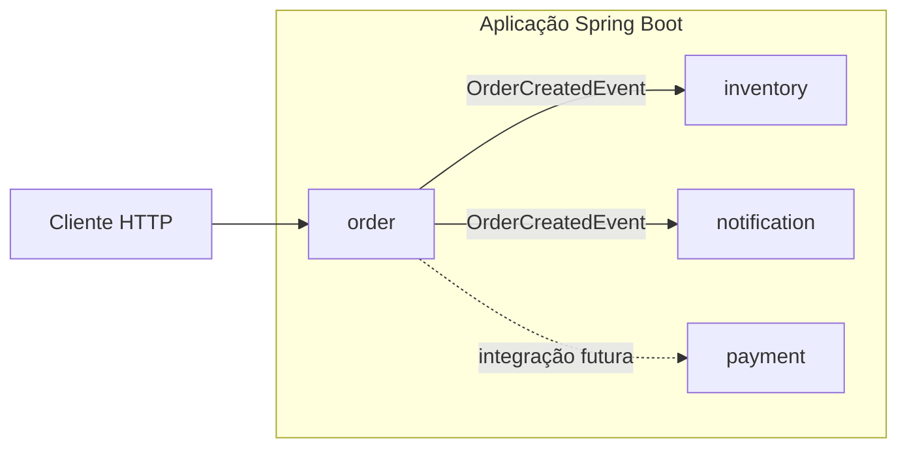
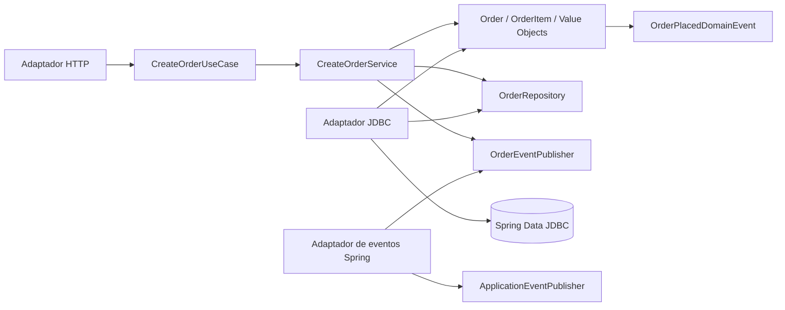
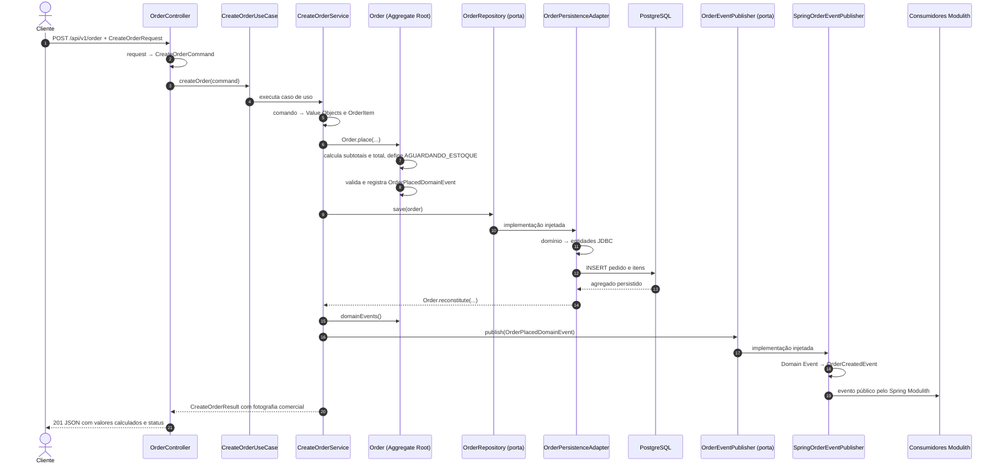

# Arquitetura do Ordermod

Este documento descreve a arquitetura atualmente implementada no projeto. O sistema é um monólito modular construído com Spring Boot e Spring Modulith, organizado por capacidades de negócio. Dentro do módulo `order`, a implementação combina arquitetura hexagonal com padrões táticos de Domain-Driven Design (DDD).

Para explicações passo a passo, consulte o [tutorial de arquitetura hexagonal](tutorial-arquitetura-hexagonal.md) e o [tutorial de DDD tático](tutorial-ddd-tatico.md).

O histórico da refatoração está em [Registro de desenvolvimento — 01/09/2026](development-log-2026-09-01.md). O estado anterior está preservado no [registro de 31/08/2026](development-log-2026-08-31.md).

## Visão geral

O pacote principal da aplicação é `com.market`. Cada subpacote direto representa um módulo lógico detectado pelo Spring Modulith:

- `com.market.order`: recebimento, persistência e publicação da criação de pedidos;
- `com.market.inventory`: reação à criação do pedido e reserva de itens, ainda sem persistência real;
- `com.market.notification`: reação à criação do pedido para notificação;
- `com.market.payment`: processamento de pagamentos, ainda sem implementação.

Os módulos são executados na mesma aplicação e no mesmo processo Java. Eles não são módulos Maven independentes nem microsserviços.



## Tecnologias

| Tecnologia | Versão ou finalidade |
| --- | --- |
| Java | 25, configurado no `pom.xml` |
| Spring Boot | 4.0.8 |
| Spring Modulith | 2.0.8 |
| Spring Web MVC | API HTTP |
| Jakarta Bean Validation | Validação das requisições |
| Spring Data JDBC | Persistência relacional do agregado de pedidos |
| PostgreSQL | Banco de dados |
| Flyway | Versionamento e aplicação das migrations |
| Spring Modulith JDBC | Registro persistente das publicações de eventos |
| Springdoc OpenAPI | Documentação e Swagger UI |
| Maven | Build e gerenciamento de dependências |
| Docker Compose | PostgreSQL para o ambiente local |

## Módulos e fronteiras

O pacote raiz de cada módulo representa sua API Java pública. Os subpacotes `internal` contêm detalhes que não devem ser acessados pelos demais módulos.

| Localização | Finalidade | Pode ser acessado por outro módulo? |
| --- | --- | --- |
| `com.market.order` | Contratos públicos do módulo `order` | Sim |
| `com.market.order.internal.*` | Implementação do módulo `order` | Não |
| `com.market.inventory` | Contratos públicos do módulo `inventory` | Sim |
| `com.market.inventory.internal.*` | Implementação do módulo `inventory` | Não |
| `com.market.notification` | Contratos públicos do módulo `notification` | Sim |
| `com.market.notification.internal.*` | Implementação do módulo `notification` | Não |
| `com.market.payment` | Contratos públicos do módulo `payment` | Sim |
| `com.market.payment.internal.*` | Implementação do módulo `payment` | Não |

`OrderCreatedEvent` permanece em `com.market.order` porque é o contrato público que os módulos consumidores importam. Os DTOs HTTP, comandos, modelos de domínio, portas e adaptadores permanecem em `com.market.order.internal`.

O nome `internal` expressa uma fronteira arquitetural do Spring Modulith, não um modificador de acesso do Java. O teste `ModularityTests` usa `ApplicationModules.of(OrdermodApplication.class).verify()` para fiscalizar acessos entre módulos e ciclos de dependência.

## Arquitetura hexagonal do módulo order

```text
src/main/java/com/market/order
├── OrderCreatedEvent.java                         # API pública entre módulos
├── package-info.java
└── internal
    ├── domain
    │   ├── event
    │   │   ├── OrderDomainEvent.java
    │   │   └── OrderPlacedDomainEvent.java
    │   ├── exception
    │   │   └── OrderDomainException.java
    │   ├── model
    │   │   ├── CustomerId.java
    │   │   ├── Order.java
    │   │   ├── OrderId.java
    │   │   ├── OrderItem.java
    │   │   ├── OrderItemId.java
    │   │   ├── PaymentMethod.java
    │   │   ├── ProductId.java
    │   │   └── Quantity.java
    │   └── package-info.java
    ├── application
    │   ├── port
    │   │   ├── in
    │   │   │   ├── CreateOrderUseCase.java
    │   │   │   ├── CreateOrderCommand.java
    │   │   │   └── CreateOrderResult.java
    │   │   └── out
    │   │       ├── OrderRepository.java
    │   │       └── OrderEventPublisher.java
    │   ├── service
    │   │   └── CreateOrderService.java
    │   └── package-info.java
    └── adapter
        ├── in
        │   └── web
        │       ├── CreateOrderRequest.java
        │       ├── OrderController.java
        │       └── OrderHttpApi.java
        └── out
            ├── persistence
            │   └── jdbc
            │       ├── OrderPersistenceAdapter.java
            │       ├── SpringDataOrderRepository.java
            │       ├── OrderJdbcEntity.java
            │       ├── OrderItemJdbcEntity.java
            │       └── OrderPersistenceMapper.java
            └── event
                └── SpringOrderEventPublisher.java
```

Os três arquivos `package-info.java` fazem parte do desenho acordado: documentam a API pública do módulo e as camadas `domain` e `application`. Não há arquivos desse tipo adicionais nos subpacotes.

### Responsabilidade de cada área

| Área | Responsabilidade | Dependências permitidas |
| --- | --- | --- |
| `domain.model` | Aggregate Root, Entity, Value Objects, estado, invariantes e comportamento | Java; não depende de Spring, JDBC ou adaptadores |
| `domain.event` | Fatos internos registrados pelo agregado | Modelo e exceção do domínio; não depende do mecanismo de publicação |
| `domain.exception` | Exceção específica para violações das invariantes de pedido | Java; não depende de Spring, JDBC ou adaptadores |
| `application.port.in` | Contratos para iniciar casos de uso | Tipos de entrada e resultado da aplicação |
| `application.service` | Orquestra o caso de uso, despacha eventos internos e delimita a transação | Domínio e portas de entrada/saída |
| `application.port.out` | Necessidades externas declaradas pela aplicação | Domínio; não depende da API técnica do Spring |
| `adapter.in.web` | Converte HTTP em chamada de caso de uso | Porta de entrada; não chama persistência diretamente |
| `adapter.out.persistence.jdbc` | Traduz o domínio e persiste com Spring Data JDBC | Porta de saída, domínio, JDBC e entidades relacionais |
| `adapter.out.event` | Traduz o Domain Event em contrato público e o publica pelo Spring | Porta de saída, contrato público e `ApplicationEventPublisher` |

### Direção das dependências

As dependências de código apontam dos adaptadores para as portas e para o núcleo da aplicação. O núcleo não conhece controllers, Spring Data repositories nem entidades JDBC.



No diagrama, as setas representam dependências de código ou chamadas através de contratos. As implementações das portas de saída são injetadas pelo Spring em tempo de execução.

## Fluxo de criação de pedido



O preço unitário e a moeda entram provisoriamente pela API enquanto o projeto não possui `Catalog/Pricing`. `OrderItem` calcula o subtotal e `Order`, como Aggregate Root, calcula o total e determina o estado inicial. Subtotais, total e status não são aceitos como fontes de verdade na requisição.

### Modelos em cada fronteira

```text
CreateOrderRequest                  contrato HTTP
        ↓ OrderController
CreateOrderCommand                  entrada do caso de uso
        ↓ CreateOrderService
Order + OrderItem + Money + demais Value Objects
        ↓ Order.place(...)
OrderPlacedDomainEvent              fato interno do domínio

Order + OrderItem + Value Objects   domínio puro
        ↓ OrderPersistenceMapper
OrderJdbcEntity + OrderItemJdbcEntity
        ↓ Spring Data JDBC
orders.orders + orders.order_items

OrderPlacedDomainEvent
        ↓ OrderEventPublisher
SpringOrderEventPublisher            tradução na borda
        ↓
OrderCreatedEvent                   contrato público
        ↓ ApplicationEventPublisher
InventoryOrderCreatedListener / NotificationOrderCreatedListener
```

Essa separação impede que mudanças no JSON ou no esquema relacional contaminem diretamente o domínio. Também permite testar o caso de uso com implementações simples das portas, sem iniciar HTTP ou PostgreSQL.

## API HTTP

O contrato HTTP fica em `adapter.in.web.OrderHttpApi`. O `OrderController` implementa essa interface e contém somente a adaptação para a porta de entrada.

| Método | Caminho | Consome | Produz | Resposta de sucesso |
| --- | --- | --- | --- | --- |
| POST | `/api/v1/order` | `application/json` | `application/json` | `201 Created` |

Exemplo de requisição:

```json
{
  "customerId": "550e8400-e29b-41d4-a716-446655440000",
  "paymentMethod": "CREDIT_CARD",
  "currency": "BRL",
  "items": [
    {
      "productId": "6ba7b810-9dad-11d1-80b4-00c04fd430c8",
      "quantity": 2,
      "unitPrice": 10.50
    },
    {
      "productId": "6ba7b811-9dad-11d1-80b4-00c04fd430c8",
      "quantity": 1,
      "unitPrice": 4.00
    }
  ]
}
```

Resposta:

```json
{
  "orderId": "fb116546-49d5-4946-86e2-a18327817eb9",
  "status": "AGUARDANDO_ESTOQUE",
  "totalAmount": 25.00,
  "currency": "BRL",
  "items": [
    {
      "productId": "6ba7b810-9dad-11d1-80b4-00c04fd430c8",
      "quantity": 2,
      "unitPrice": 10.50,
      "subtotal": 21.00
    },
    {
      "productId": "6ba7b811-9dad-11d1-80b4-00c04fd430c8",
      "quantity": 1,
      "unitPrice": 4.00,
      "subtotal": 4.00
    }
  ]
}
```

O recebimento de `unitPrice` é uma decisão temporária deste projeto de estudos. Quando houver uma fonte de preços, a aplicação deverá obtê-lo por uma porta de saída usando `productId`; os cálculos do domínio e a fotografia persistida não mudam.

### Validações de entrada

| Campo | Regra |
| --- | --- |
| `customerId` | Obrigatório e representado por UUID |
| `paymentMethod` | Obrigatório e não pode ser vazio ou composto apenas por espaços |
| `currency` | Obrigatória e validada pelo domínio como código monetário ISO 4217 |
| `items` | Obrigatório e deve conter pelo menos um item |
| `items[].productId` | Obrigatório e representado por UUID |
| `items[].quantity` | Deve ser maior que zero |
| `items[].unitPrice` | Obrigatório, maior que zero, com até 17 dígitos inteiros e duas casas decimais |

O `@Valid` no método HTTP ativa a validação do request e a validação em cascata dos itens.

## OpenAPI e Swagger UI

As anotações REST e OpenAPI ficam concentradas em `OrderHttpApi`. O controller implementa o contrato sem duplicar essas anotações.

Com a aplicação em execução nas configurações padrão:

- Swagger UI: `http://localhost:8080/swagger-ui.html`
- OpenAPI JSON: `http://localhost:8080/v3/api-docs`
- OpenAPI YAML: `http://localhost:8080/v3/api-docs.yaml`

## Persistência

O domínio não possui anotações do Spring Data JDBC. O mapeamento relacional fica exclusivamente no adaptador de saída:

- `OrderJdbcEntity` representa `orders.orders` e é a raiz do agregado JDBC;
- `OrderItemJdbcEntity` representa `orders.order_items`;
- `SpringDataOrderRepository` é o `CrudRepository` técnico;
- `OrderPersistenceMapper` desembrulha os Value Objects na ida e usa `reconstitute(...)` na volta;
- `OrderPersistenceAdapter` implementa a porta `OrderRepository` usada pelo caso de uso.

O esquema relacional versionado pelo Flyway é:

```text
orders.orders
├── id UUID PK
├── customer_id UUID
├── payment_method VARCHAR(50)
├── status VARCHAR(40)
├── total_amount NUMERIC(19,2)
├── currency CHAR(3)
├── created_at TIMESTAMPTZ
└── version INTEGER

orders.order_items
├── id UUID PK
├── order_id UUID FK → orders.orders.id
├── product_id UUID
├── quantity INTEGER CHECK > 0
├── unit_price NUMERIC(19,2) CHECK > 0
├── subtotal NUMERIC(19,2) CHECK > 0
└── item_index INTEGER
```

A migration `V2` adiciona a fotografia comercial e o estado, com checks de formato, positividade, completude e coerência entre quantidade, preço e subtotal. Ela não inventa valores para pedidos legados: as novas colunas permanecem nulas apenas nos registros anteriores à `ORDER-01`, enquanto todo pedido criado pela aplicação nova grava a fotografia completa. Antes de implementar consultas de pedidos, será necessário definir como apresentar ou arquivar esses registros legados.

`@MappedCollection` configura `order_id` como chave estrangeira e `item_index` como a posição da lista. `@Version` permite ao Spring Data JDBC distinguir um agregado novo, mesmo com UUID gerado pela aplicação, e oferece controle otimista de concorrência.

No ambiente local, o PostgreSQL do `compose.yaml` é publicado em `localhost:5433`. As credenciais de desenvolvimento atuais são banco `ordermod`, usuário `myuser` e senha `1234`.

Nos testes de integração, `PostgresTestcontainersConfiguration` fornece um PostgreSQL `18.6` isolado através de `@ServiceConnection`. O Docker Compose da aplicação é desabilitado nesse contexto, e o container efêmero recebe a migration Flyway antes dos testes de persistência.

## Eventos e transação

`CreateOrderService.createOrder` é transacional. Dentro do mesmo limite, o serviço:

1. cria os Value Objects e itens com os preços declarados e chama `Order.place(...)`;
2. cada item calcula seu subtotal; a Aggregate Root calcula o total, assume `AGUARDANDO_ESTOQUE` e registra `OrderPlacedDomainEvent`;
3. persiste o agregado através da porta `OrderRepository`;
4. entrega o Domain Event interno à porta `OrderEventPublisher`;
5. o adaptador `SpringOrderEventPublisher` o traduz em `OrderCreatedEvent` e publica o contrato público;
6. depois da publicação bem-sucedida, o serviço limpa os eventos pendentes da raiz.

`Order.place(...)` representa uma criação nova e registra o fato de domínio. `Order.reconstitute(...)`, usado pelo mapper ao reconstruir dados persistidos, preserva a versão e não registra um novo evento. Assim, uma leitura do banco não é confundida com a colocação de outro pedido.

`OrderPlacedDomainEvent` permanece em `internal.domain.event` e usa os Value Objects do modelo. `OrderCreatedEvent` permanece na raiz pública de `com.market.order` e usa tipos simples no contrato consumido por outros módulos. A tradução entre os dois ocorre no adaptador de saída, na fronteira com o mecanismo Spring.

`SpringOrderEventPublisher` é o único adaptador que conhece `OrderCreatedEvent` e `ApplicationEventPublisher`. Assim, o caso de uso trabalha apenas com `OrderDomainEvent` e não depende do contrato público nem da API técnica de publicação do Spring.

O Spring Modulith registra em `event_publication` as publicações destinadas aos listeners transacionais. A propriedade de inicialização automática do esquema JDBC continua adequada ao desenvolvimento; em produção, essa estrutura deve ser criada por migration versionada.

`InventoryOrderCreatedListener` usa o identificador estável `inventory.reserve-items-on-order-created`. O listener adapta o evento e delega para `InventoryService.reserveItems`. `InventoryService` ainda apenas valida os dados e registra a intenção no log. O módulo `notification` também reage ao evento; `payment` permanece sem comportamento.

Como persistência e publicação são chamadas dentro da transação do caso de uso, uma falha antes do commit causa rollback do pedido, dos itens e do registro da publicação. `CreateOrderTransactionIntegrationTest` protege esse comportamento simulando uma falha depois de delegar a publicação ao Spring e verificando que as três contagens permanecem inalteradas.

## Testes automatizados

A suíte cobre níveis diferentes da arquitetura e do fluxo:

| Nível | Testes e cobertura |
| --- | --- |
| Módulos | `ModularityTests` executa `ApplicationModules.verify()` para detectar ciclos e acessos indevidos entre módulos |
| Hexagonal | `HexagonalArchitectureTests` aplica quatro regras ArchUnit sobre domínio, aplicação, portas e adaptadores de entrada |
| Domínio | `OrderTest` e `OrderItemTest` verificam invariantes, identidade, criação/reconstituição, eventos, normalização e imutabilidade sem Spring |
| Caso de uso | `CreateOrderServiceTest` verifica `save` antes de `publish`, despacho do evento interno, limpeza, resultado e falhas das portas |
| Adaptador HTTP | `OrderControllerTest` verifica o mapeamento; `OrderControllerHttpTest` usa MockMvc standalone para validar `201`, texto de sucesso e `400` |
| Mapper e eventos | `OrderPersistenceMapperTest` verifica Value Objects, conversões e reconstituição sem evento falso; `SpringOrderEventPublisherTest` verifica a tradução para o evento público e a delegação técnica |
| Persistência | `OrderPersistenceAdapterTest` usa PostgreSQL 18.6 isolado, migration V1, INSERT com versão `0`, índices `0/1` e UPDATE com versão `1` |
| Integração de eventos | `CreateOrderIntegrationTest` comprova pedido, itens e duas publicações `COMPLETED`, para `inventory` e `notification` |
| Transação | `CreateOrderTransactionIntegrationTest` comprova rollback de pedido, itens e `event_publication` após falha simulada |
| Contexto | `OrdermodApplicationTests` comprova o carregamento da aplicação com o PostgreSQL de teste |

A validação final foi executada em 01/09/2026 com Java 25 e PostgreSQL 18.6 via Testcontainers:

```text
./mvnw clean test

Tests run: 50, Failures: 0, Errors: 0, Skipped: 0
BUILD SUCCESS
```

Esse resultado inclui a verificação do Spring Modulith, as quatro regras ArchUnit, os testes do modelo DDD, o contrato HTTP, o mapper, a persistência JDBC, a publicação para os dois consumidores e o rollback transacional.

## Decisões arquiteturais

1. **Monólito modular:** os módulos permanecem no mesmo deploy, com fronteiras verificáveis.
2. **Hexagonal dentro de `order`:** o módulo continua orientado ao negócio e organiza internamente entradas, núcleo e saídas.
3. **API pública mínima:** somente `OrderCreatedEvent` é compartilhado por `order`.
4. **DDD tático no núcleo:** `Order` é a Aggregate Root, `OrderItem` é uma Entity interna e os Value Objects, incluindo `Money`, tornam regras e tipos explícitos.
5. **Domínio puro:** modelo e Domain Events internos não dependem de Spring ou JDBC.
6. **Porta de entrada explícita:** o controller depende de `CreateOrderUseCase`, não da classe concreta do serviço.
7. **Portas de saída explícitas:** persistência e eventos são capacidades solicitadas pela aplicação.
8. **Adaptadores técnicos isolados:** Spring MVC, Spring Data JDBC e `ApplicationEventPublisher` ficam nas bordas.
9. **Modelos separados:** request, comando, domínio, entidades JDBC, Domain Event e evento público não são reutilizados entre fronteiras.
10. **Criação diferente de reconstituição:** somente `Order.place(...)` registra `OrderPlacedDomainEvent`.
11. **Persistência antes da publicação:** o Domain Event é registrado pela raiz durante a criação, mas só é enviado à porta depois de `save` retornar; o adaptador então o traduz e publica.
12. **Transação única de origem:** pedido, itens e registro da publicação confirmam ou sofrem rollback juntos.
13. **Contrato HTTP explícito:** o caminho permanece estável; a entrada recebe preço unitário e moeda provisoriamente, e a resposta JSON expõe a fotografia calculada e o estado inicial.
14. **Banco versionado:** alterações no esquema de negócio são feitas por migrations Flyway.

## Limitações e próximos passos

1. Retornar o `orderId` ou o cabeçalho `Location` na resposta `201 Created`.
2. Implementar reserva e persistência real no módulo `inventory`.
3. Implementar o módulo `payment` e sua reação aos eventos do pedido.
4. Tornar os consumidores idempotentes para suportar reprocessamento.
5. Criar migration da estrutura de publicação do Spring Modulith para produção.
6. Padronizar respostas de erro com `@RestControllerAdvice`.
7. Fixar uma versão específica da imagem PostgreSQL de desenvolvimento e externalizar credenciais.
8. Descobrir estados e transições reais do ciclo de pedido antes de adicionar novos padrões táticos.

Event Sourcing, CQRS, Saga, Domain Service, Specification e repository de `OrderItem` não fazem parte desta implementação. Os limites e motivos estão detalhados no [tutorial de DDD tático](tutorial-ddd-tatico.md).
