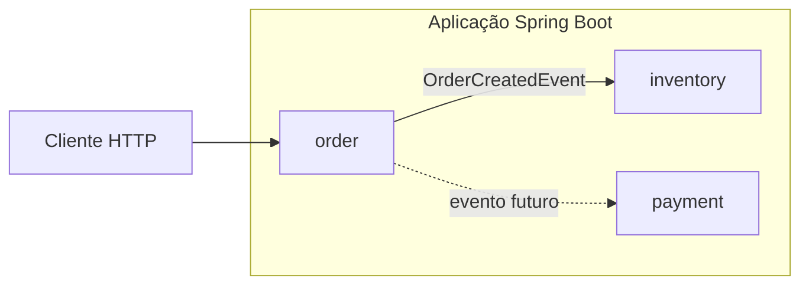
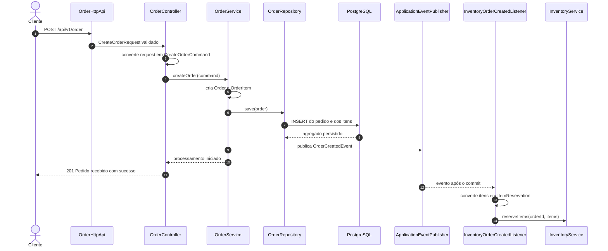

# Arquitetura do Ordermod

Este documento descreve a arquitetura atualmente implementada no projeto. O sistema é um monólito modular construído com Spring Boot e Spring Modulith, organizado por capacidades de negócio.

O histórico detalhado da evolução mais recente está em [Registro de desenvolvimento — 31/08/2026](development-log-2026-08-31.md).

## Visão geral

O pacote principal da aplicação é `com.market`. Cada subpacote direto representa um módulo lógico detectado pelo Spring Modulith:

- `com.market.order`: recebimento e criação de pedidos.
- `com.market.inventory`: reserva de itens em estoque.
- `com.market.payment`: processamento de pagamentos, ainda sem implementação.

Os módulos são executados na mesma aplicação e no mesmo processo Java. Eles não são módulos Maven independentes nem microsserviços.



## Tecnologias

| Tecnologia | Versão ou finalidade |
| --- | --- |
| Java | 25, configurado no `pom.xml` |
| Spring Boot | 4.0.8 |
| Spring Modulith | 2.0.8 |
| Spring Web MVC | API HTTP |
| Jakarta Bean Validation | Validação das requisições |
| Spring Data JDBC | Persistência do agregado de pedidos |
| PostgreSQL | Banco de dados |
| Flyway | Versionamento e aplicação das migrations |
| Spring Modulith JDBC | Registro persistente das publicações de eventos |
| Springdoc OpenAPI | 3.1.0, documentação e Swagger UI |
| Maven | Build e gerenciamento de dependências |
| Docker Compose | PostgreSQL para o ambiente local |

## Estrutura de pacotes

```text
src/main/java/com/market
├── OrdermodApplication.java
├── order
│   ├── OrderCreatedEvent.java
│   └── internal
│       ├── application
│       │   ├── CreateOrderCommand.java
│       │   └── OrderService.java
│       ├── domain
│       │   ├── Order.java
│       │   └── OrderItem.java
│       ├── infrastructure
│       │   └── persistence
│       │       └── OrderRepository.java
│       └── web
│           ├── CreateOrderRequest.java
│           ├── OrderController.java
│           └── OrderHttpApi.java
├── inventory
│   └── internal
│       ├── application
│       │   ├── InventoryOrderCreatedListener.java
│       │   └── InventoryService.java
│       ├── domain
│       ├── infrastructure
│       └── web
└── payment
    └── internal
        ├── application
        ├── domain
        ├── infrastructure
        └── web
```

Os pacotes ainda vazios possuem `package-info.java` para documentar sua finalidade e permitir que a estrutura seja versionada.

## Fronteiras dos módulos

O pacote raiz de cada módulo representa sua API Java pública. Os subpacotes representam detalhes internos.

| Localização | Finalidade | Pode ser acessado por outro módulo? |
| --- | --- | --- |
| `com.market.order` | Contratos públicos do módulo `order` | Sim |
| `com.market.order.internal.*` | Implementação do módulo `order` | Não |
| `com.market.inventory` | Contratos públicos do módulo `inventory` | Sim |
| `com.market.inventory.internal.*` | Implementação do módulo `inventory` | Não |
| `com.market.payment` | Contratos públicos do módulo `payment` | Sim |
| `com.market.payment.internal.*` | Implementação do módulo `payment` | Não |

Atualmente, `OrderCreatedEvent` é o único contrato público entre módulos. Ele fica em `com.market.order` porque `inventory` precisa importá-lo para registrar seu listener.

O nome `internal` expressa uma regra arquitetural do Spring Modulith, mas não é um modificador de acesso do Java. Como vários tipos são `public`, o compilador ainda pode aceitar um import indevido. Para fiscalizar a regra automaticamente, o projeto deverá adicionar um teste com `ApplicationModules.of(OrdermodApplication.class).verify()`.

## Responsabilidades internas

Cada módulo está preparado para usar uma separação interna por responsabilidade:

- `web`: contrato HTTP, controllers e DTOs de entrada ou saída.
- `application`: casos de uso, comandos, listeners e coordenação da aplicação.
- `domain`: agregados, entidades, objetos de valor e regras de negócio.
- `infrastructure`: persistência e integrações técnicas.

Essa separação é interna ao módulo. Uma classe de `inventory` não deve acessar nenhuma dessas camadas internas de `order`.

## Fluxo de criação de pedido



### Separação dos modelos

O fluxo não passa o DTO HTTP diretamente para o serviço:

```text
CreateOrderRequest
        ↓ mapeamento no controller
CreateOrderCommand
        ↓ processamento no serviço
OrderCreatedEvent
        ↓ mapeamento no listener
InventoryService.ItemReservation
```

Essa separação evita que mudanças no JSON ou no evento alterem diretamente os modelos internos das camadas de aplicação.

## API HTTP

O contrato HTTP está definido em `OrderHttpApi`. O `OrderController` implementa essa interface e contém apenas a adaptação para o caso de uso.

| Método | Caminho | Consome | Produz | Resposta de sucesso |
| --- | --- | --- | --- | --- |
| POST | `/api/v1/order` | `application/json` | `text/plain` | `201 Created` |

Exemplo de requisição:

```json
{
  "customerId": "550e8400-e29b-41d4-a716-446655440000",
  "paymentMethod": "PIX",
  "items": [
    {
      "productId": "6ba7b810-9dad-11d1-80b4-00c04fd430c8",
      "quantity": 2
    },
    {
      "productId": "6ba7b811-9dad-11d1-80b4-00c04fd430c8",
      "quantity": 1
    }
  ]
}
```

Resposta atual:

```text
Pedido recebido com sucesso
```

### Validações de entrada

| Campo | Regra |
| --- | --- |
| `customerId` | Obrigatório e representado por UUID |
| `paymentMethod` | Obrigatório e não pode ser vazio ou composto apenas por espaços |
| `items` | Obrigatório e deve conter pelo menos um item |
| `items[].productId` | Obrigatório e representado por UUID |
| `items[].quantity` | Deve ser maior que zero |

O `@Valid` no método HTTP ativa a validação do request. Outro `@Valid` na lista ativa a validação em cascata de cada item.

## OpenAPI e Swagger UI

As anotações REST e OpenAPI ficam concentradas em `OrderHttpApi`. O controller implementa o contrato sem duplicar essas anotações.

Com a aplicação em execução nas configurações padrão:

- Swagger UI: `http://localhost:8080/swagger-ui.html`
- OpenAPI JSON: `http://localhost:8080/v3/api-docs`
- OpenAPI YAML: `http://localhost:8080/v3/api-docs.yaml`

## Eventos entre módulos

### Evento publicado

Após persistir o agregado, `OrderService` chama o método privado `publishOrderCreatedEvent` e publica `OrderCreatedEvent` através do `ApplicationEventPublisher`. A persistência e a publicação estão dentro da mesma transação. O evento contém:

| Campo | Tipo | Finalidade |
| --- | --- | --- |
| `orderId` | `UUID` | Identificador gerado pelo servidor |
| `createdAt` | `Instant` | Instante da criação gerado pelo servidor |
| `customerId` | `UUID` | Cliente do pedido |
| `paymentMethod` | `String` | Forma de pagamento recebida |
| `items` | `List<Item>` | Produtos e respectivas quantidades |

A lista do evento é copiada com `List.copyOf`, evitando alteração posterior da coleção publicada.

### Consumo no inventory

`InventoryOrderCreatedListener` utiliza `@ApplicationModuleListener(id = "inventory.reserve-items-on-order-created")` para receber `OrderCreatedEvent` após a confirmação da transação de origem. O identificador explícito torna a coluna `listener_id` mais legível e deve permanecer estável. O listener não implementa a regra de estoque; ele adapta o evento para `InventoryService.ItemReservation` e delega para `InventoryService.reserveItems`.

`InventoryService` atualmente:

- valida o identificador do pedido;
- valida a existência dos itens;
- valida produto e quantidade de cada reserva;
- registra no log a intenção de reserva.

Ainda não existe alteração ou persistência real de estoque.

### Registro persistente de eventos

O projeto utiliza `spring-modulith-starter-jdbc`. A propriedade abaixo está habilitada no ambiente atual:

```yaml
spring:
  modulith:
    events:
      jdbc:
        schema-initialization:
          enabled: true
```

Ela permite ao Spring Modulith criar a estrutura JDBC utilizada para registrar publicações destinadas a listeners transacionais. A criação automática é conveniente em desenvolvimento. Em produção, essa estrutura deve ser criada por uma migration versionada.

## Persistência e ambiente local

O `compose.yaml` declara um PostgreSQL para desenvolvimento, publicado em `localhost:5433`, pois a porta `5432` já é utilizada por outro projeto local. As credenciais atuais são:

| Configuração | Valor |
| --- | --- |
| Banco | `ordermod` |
| Usuário | `myuser` |
| Senha | `1234` |
| Porta do host | `5433` |

O Flyway controla a evolução do banco. Como `event_publication` já existia antes da adoção do Flyway, a aplicação cria um baseline na versão `0`. A migration `V1__create_order_tables.sql` cria:

```text
orders.orders
orders.order_items
```

O esquema relacional é:

```text
orders.orders
├── id UUID PK
├── customer_id UUID
├── payment_method VARCHAR(50)
├── created_at TIMESTAMPTZ
└── version INTEGER

orders.order_items
├── id UUID PK
├── order_id UUID FK → orders.orders.id
├── product_id UUID
├── quantity INTEGER CHECK > 0
└── item_index INTEGER
```

`Order` é a raiz do agregado e possui uma coleção imutável de `OrderItem`. `OrderRepository` estende `CrudRepository<Order, UUID>`. O `@MappedCollection` usa `order_id` como chave estrangeira e `item_index` para preservar a ordem da lista. O `@Version` permite distinguir um agregado novo mesmo com UUID gerado pela aplicação e prepara o modelo para controle otimista de concorrência.

No caso de uso `createOrder`, o pedido e seus itens são persistidos antes da publicação. Como ambas as operações estão em `@Transactional`, uma falha antes do commit desfaz a persistência e o registro da publicação.

Ainda não existem modelo ou persistência de estoque nem persistência do módulo `payment`.

## Testes atuais

| Teste | Cobertura atual |
| --- | --- |
| `OrdermodApplicationTests` | Carregamento do contexto Spring |
| `OrderServiceTest` | Persistência antes da publicação e equivalência entre agregado e evento |
| `OrderTest` | Imutabilidade dos itens, normalização e invariantes do pedido |
| `OrderItemTest` | Quantidade positiva dos itens |

O teste de `OrderService` usa um repositório falso e um capturador simples de eventos, sem inicializar o contexto Spring nem o banco de dados. Os cinco testes unitários específicos passam com Java 25. O teste geral de contexto ainda precisa receber uma configuração de banco própria para a execução de testes.

## Decisões arquiteturais atuais

1. **Monólito modular:** os módulos permanecem no mesmo deploy, mas possuem fronteiras lógicas.
2. **Organização por negócio:** `order`, `inventory` e `payment` representam capacidades, não camadas globais.
3. **Encapsulamento:** somente tipos no pacote raiz do módulo formam a API Java pública.
4. **Integração por eventos:** `order` não chama diretamente um serviço interno de `inventory`.
5. **DTO separado do comando:** o contrato HTTP não chega à camada de aplicação.
6. **Evento separado do comando:** outros módulos recebem um fato público, não um tipo interno de `order`.
7. **Listener separado do service:** o listener adapta a mensagem; o service representa o caso de uso de estoque.
8. **Contrato HTTP separado:** `OrderHttpApi` concentra REST e OpenAPI; `OrderController` implementa o comportamento.
9. **Dados gerados pelo servidor:** `orderId` e `createdAt` não são aceitos do cliente.
10. **Agregado explícito:** `Order` controla seus `OrderItem` e é persistido por um único repositório.
11. **Banco versionado:** alterações de estrutura são feitas por migrations Flyway.
12. **Persistência antes do evento:** `OrderCreatedEvent` somente é publicado depois de `OrderRepository.save`.
13. **Transação única de origem:** pedido, itens e publicação persistente confirmam ou sofrem rollback juntos.

## Limitações e próximos passos

O estado atual persiste e publica a criação de pedidos, mas ainda não representa um fluxo de compra completo. Os próximos passos recomendados são:

1. Retornar o `orderId` ou o cabeçalho `Location` na resposta `201 Created`.
2. Implementar reserva e persistência real no módulo `inventory`.
3. Implementar o módulo `payment` e seu listener para o evento do pedido.
4. Criar migrations para estoque e para a estrutura do registro de eventos.
5. Definir eventos de sucesso e falha, como estoque reservado ou estoque indisponível.
6. Padronizar respostas de erro com `@RestControllerAdvice`.
7. Adicionar teste de fronteiras com `ApplicationModules.verify()`.
8. Configurar um PostgreSQL isolado para os testes de integração.
9. Adicionar testes HTTP, de persistência e dos listeners.
10. Fixar uma versão específica da imagem PostgreSQL em vez de usar `latest`.
