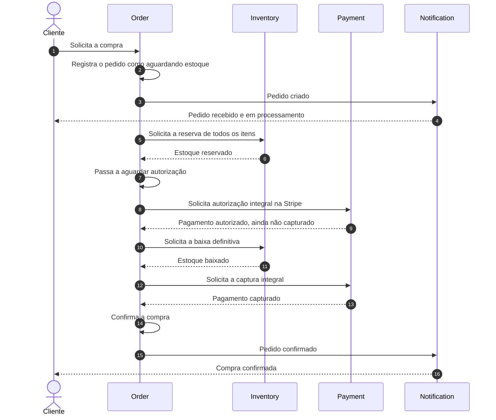

# Processo lógico de uma operação de compra

## Objetivo deste documento

Este documento explica, sob a perspectiva do negócio, como uma compra percorre os módulos `Order`, `Inventory`, `Payment` e `Notification` a partir do momento em que o cliente envia um pedido.

O foco está no processo, nas responsabilidades, nos dados e nos acontecimentos relevantes. Os nomes de estados e eventos propostos servem como uma linguagem comum para descrever o negócio; eles não significam que tudo já esteja implementado no projeto.

É importante separar duas visões:

1. **fluxo atual:** aquilo que o sistema realmente faz hoje;
2. **fluxo completo recomendado:** aquilo que ainda precisa existir para que o pedido se transforme em uma compra efetivamente concluída.

## Decisão de escopo do estudo

O processo de pagamento descrito neste documento considera exclusivamente:

- **cartão de crédito à vista**, com cobrança integral em uma única parcela;
- **Stripe** como plataforma externa de pagamento;
- **autorização prévia do valor e captura posterior**;
- captura integral do valor autorizado, sem capturas parciais;
- uma operação de pagamento relacionada a cada pedido.

Cartão de débito, PIX, boleto, parcelamento, múltiplas capturas e divisão do pagamento entre diferentes meios ficam fora do escopo deste estudo.

“À vista” define que o valor total será cobrado em uma única parcela. Isso não impede que a operação seja dividida em dois momentos lógicos:

1. **autorização:** a Stripe solicita ao emissor do cartão que garanta e retenha temporariamente o valor;
2. **captura:** depois que a regra interna de estoque for cumprida, a Stripe efetiva a cobrança do valor autorizado.

A autorização não deve ser tratada como pagamento concluído. O cliente pode enxergar uma retenção temporária no cartão, mas `Order` somente confirma a compra depois da baixa definitiva do estoque e da confirmação da captura.

## Ideia central: pedido criado não é compra concluída

Quando o cliente pressiona o botão de comprar, ele manifesta uma **intenção de compra**. O sistema precisa registrar essa intenção antes de saber se toda a operação poderá ser concluída.

Uma compra só deve ser considerada confirmada quando todas estas condições forem verdadeiras:

- os produtos tiverem sido reservados para aquele pedido;
- o valor total tiver sido autorizado pela Stripe;
- `Inventory` tiver realizado a baixa definitiva do estoque;
- a Stripe tiver confirmado a captura integral do valor autorizado.

Portanto:

```text
PEDIDO CRIADO
    não significa
COMPRA CONFIRMADA
```

O pedido funciona como o registro central do processo. Ele nasce, aguarda as decisões de estoque e pagamento e, por fim, é confirmado, cancelado ou expirado.

## Três conceitos usados no processo

### Solicitação

Uma solicitação representa algo que um módulo deseja que outro faça.

Exemplos:

- reservar os itens do pedido;
- autorizar o valor total do cartão;
- realizar a baixa definitiva do estoque;
- capturar o valor autorizado;
- liberar uma reserva;
- cancelar uma autorização ainda não capturada;
- realizar um estorno;
- enviar uma comunicação ao cliente.

Uma solicitação ainda não representa sucesso. “Reservar estoque” não significa “estoque reservado”.

### Evento

Um evento representa um fato que já aconteceu e não deve ser reescrito.

Exemplos:

- pedido criado;
- estoque reservado;
- pagamento autorizado;
- estoque baixado;
- pagamento capturado;
- pedido cancelado;
- notificação enviada.

Os eventos devem ser expressos no passado porque comunicam resultados, e não intenções.

### Compensação

Uma compensação desfaz, dentro das possibilidades do negócio, uma etapa que já havia sido concluída quando uma etapa posterior falha.

Exemplos:

- liberar o estoque reservado quando a autorização for recusada;
- cancelar a autorização quando a baixa definitiva do estoque falhar;
- reintegrar o estoque se a baixa tiver ocorrido, mas a captura não puder ser concluída;
- estornar o pagamento quando a captura tiver ocorrido e uma decisão posterior exigir o cancelamento.

Uma compra atravessa módulos diferentes e pode levar algum tempo. Por isso, o processo não deve depender da ideia de que tudo será concluído instantaneamente.

# 1. O que acontece no projeto atualmente

## 1.1 Fluxo atual

Hoje, o fluxo lógico efetivamente existente é o seguinte:

1. O cliente envia sua identificação, a forma de pagamento, a moeda e os produtos com quantidades e preços unitários declarados.
2. `Order` valida os dados básicos e monetários.
3. `OrderItem` calcula os subtotais e `Order` calcula o total, cria e registra o pedido como `AGUARDANDO_ESTOQUE`.
4. `Order` anuncia o evento **Pedido criado**.
5. `Inventory` recebe esse evento, confere se os dados necessários estão presentes e registra uma mensagem dizendo que reservará os itens.
6. `Notification` recebe o mesmo evento e registra uma mensagem que representa uma intenção de notificação.
7. `Payment` não participa do processo porque ainda não possui comportamento.
8. O cliente recebe uma resposta JSON com o identificador, o estado e a fotografia comercial calculada.

Essa resposta significa apenas que a solicitação foi aceita e registrada. Ela não comprova que:

- havia estoque disponível;
- os itens foram realmente reservados;
- o pagamento foi realizado;
- o cliente recebeu uma notificação real;
- o pedido foi confirmado.

## 1.2 Visão resumida do fluxo atual

```text
Cliente
   ↓
Order calcula e registra o pedido como aguardando estoque
   ↓
Pedido criado
   ├──→ Inventory valida os itens e apenas registra a intenção de reserva
   └──→ Notification apenas registra uma intenção de comunicação

Payment não participa
Não existe resultado de estoque
Não existe resultado de pagamento
Não existe confirmação ou cancelamento do pedido
```

## 1.3 Consequência prática

O sistema atual demonstra corretamente a criação do pedido e a comunicação inicial entre módulos, mas ainda representa somente o início da jornada de compra.

`Inventory` não informa se conseguiu ou não reservar. `Payment` não cobra. Como esses resultados não existem, `Order` não tem elementos suficientes para decidir entre confirmação e cancelamento.

O campo atual de forma de pagamento aceita um texto genérico. A restrição para cartão de crédito à vista e a relação com uma operação da Stripe pertencem ao fluxo recomendado e ainda não existem no comportamento atual.

Como ainda não existe `Catalog/Pricing`, o preço unitário entra provisoriamente pela API e é considerado declarado pelo cliente apenas para fins de estudo. Subtotais e total nunca entram prontos: são calculados pelo domínio. Em uma evolução futura, somente a origem do preço deve mudar para uma fonte confiável.

# 2. Responsabilidade lógica de cada módulo

## 2.1 Order: dono do ciclo de vida do pedido

`Order` representa a intenção de compra e o estado geral do processo.

Suas responsabilidades de negócio são:

- registrar o pedido solicitado pelo cliente;
- preservar os produtos, quantidades e valores acordados naquele momento;
- registrar que a forma de pagamento deste estudo é cartão de crédito à vista;
- acompanhar os resultados de estoque e pagamento;
- decidir quando o pedido pode ser confirmado;
- decidir quando o pedido deve ser cancelado ou expirado;
- registrar o motivo de uma decisão negativa;
- anunciar as mudanças relevantes do pedido.

`Order` não deve assumir que reservou produtos nem que recebeu dinheiro. Ele deve aguardar os fatos produzidos pelos módulos responsáveis.

## 2.2 Inventory: dono da disponibilidade e das reservas

`Inventory` representa a verdade sobre as quantidades físicas, reservadas e disponíveis dos produtos.

Suas responsabilidades de negócio são:

- verificar se todos os produtos solicitados possuem disponibilidade;
- reservar temporariamente as quantidades para um pedido específico;
- impedir que a mesma unidade seja prometida para dois pedidos;
- realizar a baixa definitiva depois que o valor do cartão estiver autorizado;
- informar se a baixa definitiva foi concluída ou falhou;
- liberar a reserva quando a autorização for recusada ou cancelada antes da baixa;
- reintegrar o estoque quando, depois da baixa, estiver confirmado que a captura não aconteceu;
- expirar reservas abandonadas;
- informar claramente quais itens não puderam ser atendidos.

No fluxo recomendado, a política inicial é **tudo ou nada**: se algum item não puder ser reservado, a reserva do pedido inteiro é recusada. Entregas parciais ou itens pendentes exigiriam regras adicionais e não são presumidos neste documento.

## 2.3 Payment: dono da movimentação financeira

`Payment` representa a verdade sobre a cobrança relacionada ao pedido.

Suas responsabilidades de negócio são:

- receber o valor confiável calculado para o pedido;
- criar e acompanhar a operação correspondente na Stripe;
- solicitar a autorização integral do valor no cartão de crédito;
- distinguir claramente valor autorizado de valor efetivamente capturado;
- aguardar a confirmação da baixa definitiva do estoque antes de capturar;
- solicitar a captura integral do valor autorizado;
- cancelar uma autorização que não deva mais ser capturada;
- informar autorização, recusa, expiração, captura ou falha;
- impedir cobrança duplicada para a mesma tentativa;
- realizar estorno somente quando um valor já capturado precisar ser devolvido;
- manter a referência financeira necessária para conciliação e auditoria.

`Payment` não decide se existe estoque e não confirma o pedido por conta própria. Ele traduz para o negócio os resultados recebidos da Stripe. `Order` usa esses resultados, junto com o resultado de `Inventory`, para tomar a decisão geral.

## 2.4 Notification: dono da comunicação com o cliente

`Notification` transforma fatos relevantes da compra em mensagens compreensíveis para o cliente.

Suas responsabilidades de negócio são:

- escolher a mensagem adequada para cada etapa;
- escolher o canal permitido, como e-mail, SMS ou notificação no aplicativo;
- localizar o destinatário correto;
- registrar tentativas e resultados de envio;
- repetir uma tentativa quando houver uma falha temporária;
- evitar mensagens duplicadas;
- distinguir pedido recebido de pedido confirmado.

`Notification` não aprova pagamento, não reserva estoque e não altera a decisão do pedido. Uma falha de e-mail não deve cancelar uma compra que já foi paga e confirmada.

# 3. Atributos e eventos de cada módulo

## 3.1 Order

### Atributos existentes hoje

| Atributo | Significado lógico |
| --- | --- |
| `orderId` | Identificador único do pedido |
| `customerId` | Identificador do cliente que realizou o pedido |
| `paymentMethod` | Forma de pagamento escolhida |
| `status` | Etapa atual; novos pedidos iniciam em `AGUARDANDO_ESTOQUE` |
| `totalAmount` | Soma dos subtotais calculada pelo pedido |
| `currency` | Moeda única da fotografia comercial |
| `createdAt` | Momento em que o pedido foi criado |
| `items` | Relação de itens solicitados |
| `itemId` | Identificador do item dentro do pedido |
| `productId` | Produto relacionado ao item |
| `quantity` | Quantidade solicitada daquele produto |
| `unitPrice` | Preço unitário declarado nesta etapa de estudo e congelado no item |
| `itemSubtotal` | Quantidade multiplicada pelo preço unitário, calculada pelo domínio |
| controle de versão | Controle interno das alterações do pedido, sem significado direto para o cliente |

### Informações importantes que ainda não existem

Para uma operação comercial completa, `Order` deveria preservar também:

| Atributo recomendado | Finalidade |
| --- | --- |
| `discountAmount` | Registrar descontos aplicados, quando existirem |
| `shippingAmount` | Registrar frete, quando aplicável |
| `inventoryReservationId` | Relacionar o pedido à reserva de estoque |
| `paymentId` | Relacionar o pedido à operação financeira |
| `paymentProvider` | Registrar que a operação financeira usa a Stripe |
| `paymentType` | Registrar cartão de crédito à vista como modalidade escolhida neste estudo |
| `authorizationExpiresAt` | Preservar no pedido uma cópia do limite de captura informado por `Payment` a partir da Stripe |
| `updatedAt` | Indicar a última mudança relevante |
| `confirmedAt` | Registrar quando a compra foi confirmada |
| `cancelledAt` | Registrar quando o pedido foi cancelado |
| `cancellationReason` | Explicar por que o pedido foi cancelado |
| dados de entrega | Endereço e modalidade de entrega, caso o negócio venda produtos físicos |

O total não é aceito a partir de um valor informado livremente pelo comprador: `Order` o calcula. Nesta etapa de estudo, o preço unitário ainda é declarado na API; em produção, ele deverá vir de uma fonte comercial confiável sem alterar as regras de cálculo do domínio.

### Estados recomendados para Order

| Estado | Significado |
| --- | --- |
| `AGUARDANDO_ESTOQUE` | Pedido esperando o resultado da reserva |
| `AGUARDANDO_AUTORIZACAO` | Estoque reservado; valor do cartão ainda precisa ser autorizado |
| `AGUARDANDO_BAIXA_ESTOQUE` | Stripe autorizou o valor; pedido espera a baixa definitiva dos itens |
| `AGUARDANDO_CAPTURA` | Estoque baixado; valor autorizado já pode ser capturado |
| `CONFIRMADO` | Estoque baixado e captura integral confirmada |
| `CANCELAMENTO_PENDENTE` | Cancelamento iniciado, mas ainda existem compensações em andamento |
| `CANCELADO` | Pedido encerrado sem conclusão da compra |
| `EXPIRADO` | Reserva ou autorização venceu antes da conclusão |

### Eventos que Order produz hoje

O projeto possui dois nomes para representar o mesmo acontecimento em contextos diferentes:

- **Pedido colocado:** fato registrado dentro do próprio domínio de pedidos;
- **Pedido criado (`OrderCreatedEvent`):** fato compartilhado com os outros módulos.

Isso não representa duas compras nem duas criações. É o mesmo acontecimento expresso para públicos diferentes.

O evento compartilhado atual contém:

- identificador do pedido;
- momento da criação;
- identificador do cliente;
- forma de pagamento;
- estado inicial;
- moeda e total calculado;
- lista de produtos, quantidades, preços unitários e subtotais.

Ele ainda não contém prazo de reserva ou endereço do cliente.

### Eventos recomendados para Order

| Evento | Quando acontece | Informações principais |
| --- | --- | --- |
| **Pedido criado** | A intenção de compra foi validada e registrada | pedido, cliente, itens, valores, moeda, forma de pagamento e data |
| **Pedido aguardando autorização** | O estoque foi reservado temporariamente e a Stripe pode autorizar o cartão | pedido, reserva, total, moeda e prazo |
| **Pedido pronto para captura** | A autorização existe e o estoque foi baixado definitivamente | pedido, reserva, pagamento, valor e limite de captura |
| **Pedido confirmado** | A baixa do estoque e a captura integral obtiveram sucesso | pedido, reserva, pagamento e momento da confirmação |
| **Cancelamento de pedido iniciado** | O pedido precisa ser desfeito, mas ainda há estoque ou pagamento a compensar | pedido, motivo e compensações necessárias |
| **Pedido cancelado** | Todas as etapas necessárias do cancelamento terminaram | pedido, motivo e momento do cancelamento |
| **Pedido expirado** | O prazo de conclusão terminou | pedido, etapa que expirou e momento da expiração |

### Eventos que Order precisa observar

Para controlar o estado geral, `Order` precisa conhecer resultados como:

- estoque reservado;
- reserva de estoque recusada;
- reserva expirada;
- pagamento autorizado;
- autorização recusada;
- autorização cancelada;
- autorização expirada;
- baixa definitiva do estoque concluída;
- falha na baixa do estoque;
- pagamento capturado;
- falha na captura;
- resultado financeiro inconclusivo;
- estoque liberado;
- estoque reintegrado;
- estorno concluído ou malsucedido.

## 3.2 Inventory

### Atributos existentes hoje

O módulo ainda não possui uma reserva persistente nem um registro completo de estoque. Durante o processamento atual, ele conhece apenas:

| Atributo | Significado lógico |
| --- | --- |
| `orderId` | Pedido que solicitou a reserva |
| `productId` | Produto que deveria ser reservado |
| `quantity` | Quantidade desejada |

Hoje esses dados são validados, mas nenhuma quantidade é efetivamente reservada ou alterada.

### Atributos recomendados para o saldo de um produto

| Atributo recomendado | Finalidade |
| --- | --- |
| `productId` | Identificar o produto |
| `onHandQuantity` | Quantidade física conhecida |
| `reservedQuantity` | Quantidade prometida para pedidos ainda não concluídos |
| `availableQuantity` | Quantidade que ainda pode ser oferecida; normalmente físico menos reservado |
| `updatedAt` | Momento da última alteração do saldo |

### Atributos recomendados para uma reserva

| Atributo recomendado | Finalidade |
| --- | --- |
| `reservationId` | Identificar unicamente a reserva |
| `orderId` | Relacionar a reserva ao pedido |
| `items` | Produtos e quantidades reservados |
| `status` | Informar se a reserva está ativa, baixada, liberada, recusada, reintegrada ou expirada |
| `reservedAt` | Momento em que os itens foram separados logicamente |
| `expiresAt` | Limite de tempo da reserva temporária |
| `deductedAt` | Momento em que ocorreu a baixa definitiva do estoque |
| `releasedAt` | Momento em que as quantidades voltaram a ficar disponíveis |
| `reinstatedAt` | Momento em que uma baixa foi revertida por falha posterior |
| `failureReason` | Motivo de uma eventual recusa |
| `restorationReason` | Motivo pelo qual uma baixa definitiva precisou ser reintegrada |

### Estados recomendados para uma reserva

| Estado | Significado |
| --- | --- |
| `SOLICITADA` | Reserva recebida e ainda em avaliação |
| `RESERVADA` | Quantidades separadas temporariamente para o pedido |
| `RECUSADA` | Um ou mais itens não puderam ser reservados |
| `BAIXADA` | Quantidades retiradas definitivamente do estoque comercial após a autorização do cartão |
| `LIBERADA` | Quantidades devolvidas à disponibilidade |
| `REINTEGRADA` | Baixa revertida depois de confirmado definitivamente que a captura não aconteceu |
| `EXPIRADA` | Prazo da reserva terminou antes da baixa definitiva |

### Eventos existentes hoje

`Inventory` ainda não produz eventos de resultado. Ele somente reage a **Pedido criado** e registra uma intenção de reserva.

### Eventos recomendados para Inventory

| Evento | Quando acontece | Informações principais |
| --- | --- | --- |
| **Estoque reservado** | Todos os itens foram reservados | reserva, pedido, itens, data e validade |
| **Reserva de estoque recusada** | Pelo menos um item não possui disponibilidade ou não pode ser reservado | pedido, itens indisponíveis, quantidades solicitadas/disponíveis e motivo |
| **Estoque baixado** | O cartão foi autorizado e as quantidades foram baixadas definitivamente | reserva, pedido, itens e data da baixa |
| **Falha na baixa do estoque** | A reserva não pôde ser convertida em baixa definitiva | reserva, pedido, itens e motivo |
| **Estoque liberado** | Uma reserva foi devolvida após cancelamento, recusa ou falha | reserva, pedido, itens e motivo |
| **Estoque reintegrado** | Uma baixa anterior foi revertida depois da confirmação de que não houve captura | reserva, pedido, itens e motivo |
| **Reserva de estoque expirada** | O prazo terminou antes da baixa definitiva | reserva, pedido, itens e data de expiração |

## 3.3 Payment

### Estado atual

O módulo `Payment` existe apenas como uma fronteira prevista para o negócio. Atualmente ele não possui atributos, estados, operações ou eventos de pagamento.

Além disso, o pedido atual não registra preços ou valor total. Portanto, mesmo que `Payment` reagisse hoje ao evento de criação, ele não saberia quanto deveria cobrar.

### Requisito de pagamento adotado no estudo

O módulo será responsável por pagamentos com **cartão de crédito à vista pela Stripe**, usando autorização e captura separadas.

O significado de cada momento é:

| Momento | Significado para o negócio |
| --- | --- |
| **Autorização** | A Stripe confirma que o valor integral pode ser retido no cartão; a cobrança ainda não está concluída |
| **Baixa definitiva do estoque** | `Inventory` transforma a reserva temporária em saída definitiva do estoque comercial |
| **Captura** | A Stripe efetiva a cobrança do valor que estava autorizado |
| **Cancelamento da autorização** | A retenção ainda não capturada é liberada porque a compra não prosseguirá |
| **Estorno** | Um valor que já foi capturado é devolvido depois de um cancelamento posterior |

Assim, “pagamento autorizado” e “pagamento capturado” são fatos diferentes. O primeiro permite prosseguir para a baixa do estoque; somente o segundo permite confirmar a compra.

A Stripe chama esse modelo de autorização e captura separadas. Depois da autorização, o pagamento fica disponível para captura por um prazo limitado. Esse prazo depende das condições da operação e deve ser obtido da própria Stripe, e não presumido como um número fixo pelo negócio. Se a captura não acontecer antes do limite, a autorização expira e os fundos são liberados.

Para o estudo, cada pedido terá uma única operação de pagamento na Stripe, com autorização e captura do valor integral. Captura parcial, parcelamento, múltiplas capturas e troca de meio de pagamento ficam fora do escopo.

### Atributos recomendados

| Atributo recomendado | Finalidade |
| --- | --- |
| `paymentId` | Identificar unicamente a operação financeira |
| `orderId` | Relacionar o pagamento ao pedido |
| `customerId` | Relacionar a cobrança ao comprador |
| `amount` | Valor exato a ser cobrado |
| `currency` | Moeda do pagamento |
| `paymentMethod` | Registrar a modalidade fixa cartão de crédito à vista |
| `paymentProvider` | Registrar a Stripe como plataforma responsável pela operação externa |
| `providerPaymentId` | Relacionar o pagamento interno à operação correspondente na Stripe |
| `status` | Situação atual do pagamento |
| `attemptId` | Identificar uma tentativa e impedir cobranças repetidas indevidas |
| `createdAt` | Momento da criação do pagamento |
| `authorizationAmount` | Valor que a Stripe autorizou |
| `authorizedAt` | Momento em que a autorização foi confirmada |
| `capturableAmount` | Valor que está disponível para captura |
| `captureBefore` | Limite informado pela Stripe para realizar a captura |
| `capturedAmount` | Valor efetivamente capturado |
| `capturedAt` | Momento em que a captura foi confirmada |
| `declineReason` | Motivo conhecido de uma recusa |
| `authorizationCancelledAt` | Momento em que uma autorização foi cancelada |
| `refundedAmount` | Valor já estornado |
| `refundedAt` | Momento do estorno |

Dados sensíveis de cartão não devem fazer parte dos eventos de compra. O processo precisa trabalhar com referências seguras da operação financeira, não com o número completo ou o código de segurança do cartão.

### Estados recomendados para Payment

| Estado | Significado |
| --- | --- |
| `SOLICITADO` | Solicitação de autorização recebida |
| `AUTORIZANDO` | Stripe e emissor do cartão estão avaliando a autorização |
| `AGUARDANDO_ACAO_CLIENTE` | Cliente precisa concluir uma autenticação solicitada |
| `AUTORIZADO` | Valor retido e disponível para captura, mas ainda não cobrado definitivamente |
| `CAPTURANDO` | Captura do valor autorizado em andamento |
| `CAPTURADO` | Cobrança integral efetivada pela Stripe |
| `AUTORIZACAO_RECUSADA` | Emissor recusou a autorização do valor |
| `AUTORIZACAO_CANCELADA` | Retenção cancelada porque a compra não prosseguiu |
| `AUTORIZACAO_EXPIRADA` | Prazo terminou antes da captura |
| `CAPTURA_FALHOU` | Stripe confirmou definitivamente que não houve captura e a compensação pode começar |
| `RESULTADO_INCONCLUSIVO` | Ainda não é seguro afirmar se a operação financeira terminou |
| `ESTORNO_PENDENTE` | Devolução solicitada e ainda não concluída |
| `ESTORNADO` | Valor devolvido com sucesso |

Uma falha temporária não deve ser confundida com uma recusa. Quando o resultado for inconclusivo, o módulo precisa descobrir o estado real na Stripe antes de repetir a cobrança, reintegrar o estoque ou encerrar o pedido.

### Eventos recomendados para Payment

| Evento | Quando acontece | Informações principais |
| --- | --- | --- |
| **Autorização de pagamento iniciada** | A operação foi criada na Stripe e a autorização começou | pagamento, pedido, valor, moeda e data |
| **Ação do cliente necessária** | A autorização depende de autenticação adicional do titular | pagamento, pedido, ação e prazo |
| **Pagamento autorizado** | O valor integral foi autorizado e está disponível para captura | pagamento, pedido, valor autorizado, valor capturável, referência e limite de captura |
| **Autorização recusada** | O emissor rejeitou a autorização | pagamento, pedido, motivo permitido e data |
| **Autorização cancelada** | A retenção foi cancelada antes da captura | pagamento, pedido, motivo e data |
| **Autorização expirada** | O limite de captura terminou | pagamento, pedido, valor e data |
| **Captura de pagamento iniciada** | A baixa definitiva do estoque permitiu solicitar a captura | pagamento, pedido, valor e data |
| **Pagamento capturado** | A Stripe confirmou a cobrança integral | pagamento, pedido, valor capturado, referência e data |
| **Falha na captura** | A Stripe confirmou definitivamente que não houve captura | pagamento, pedido, natureza da falha e condição para compensação |
| **Resultado financeiro inconclusivo** | Ainda não é seguro afirmar se houve captura | pagamento, pedido e dados necessários à conciliação |
| **Estorno concluído** | Um valor já capturado foi devolvido | pagamento, pedido, valor estornado, referência e data |
| **Falha no estorno** | A devolução ainda não pôde ser concluída | pagamento, pedido, valor e motivo |

### Correspondência conceitual com a Stripe

Sem transformar este documento em um guia de programação, quatro resultados externos são especialmente importantes:

| Resultado informado pela Stripe | Interpretação de negócio no módulo Payment |
| --- | --- |
| Valor autorizado e disponível para captura | **Pagamento autorizado**; ainda não é compra concluída |
| Pagamento concluído com sucesso | **Pagamento capturado** |
| Autorização recusada pelo emissor | **Autorização recusada** |
| Captura conclusivamente malsucedida | **Falha na captura** |
| Resultado externo ainda desconhecido | **Resultado financeiro inconclusivo** |
| Operação cancelada antes da captura | **Autorização cancelada** |

As decisões do pedido devem usar confirmações oficiais da Stripe, não somente a página que o cliente visualizou ao retornar da operação de pagamento. O cliente pode fechar essa página, repeti-la ou perder a conexão sem que isso determine o resultado financeiro real.

## 3.4 Notification

### Estado atual

`Notification` recebe o evento **Pedido criado**, mas atualmente utiliza apenas:

- o identificador do pedido;
- a quantidade de linhas de itens.

Ele registra uma mensagem, mas não envia uma comunicação real. Também não possui o e-mail, telefone ou preferência de canal do cliente. A mensagem atual menciona estoque, embora pertença ao contexto de notificação.

### Atributos recomendados

| Atributo recomendado | Finalidade |
| --- | --- |
| `notificationId` | Identificar a comunicação |
| `orderId` | Relacionar a mensagem ao pedido |
| `customerId` | Identificar o destinatário no contexto de negócio |
| `notificationType` | Pedido recebido, ação no cartão necessária, pedido confirmado, cancelamento etc. |
| `channel` | E-mail, SMS, aplicativo ou outro canal |
| `recipient` | Endereço ou referência do destinatário |
| `template` | Modelo de mensagem adequado ao acontecimento |
| `status` | Situação da entrega |
| `attemptCount` | Quantidade de tentativas realizadas |
| `createdAt` | Momento em que a comunicação foi preparada |
| `sentAt` | Momento do envio |
| `deliveredAt` | Momento da entrega, quando o canal oferecer essa confirmação |
| `failureReason` | Motivo de falha do envio |

Caso os dados de contato sejam mantidos por outro contexto do negócio, `Notification` pode usar `customerId` para encontrá-los. O evento do pedido não precisa carregar dados pessoais desnecessários, mas deve existir uma fonte confiável para localizar o destinatário.

### Estados recomendados para Notification

| Estado | Significado |
| --- | --- |
| `PREPARADA` | Mensagem criada |
| `AGUARDANDO_ENVIO` | Comunicação pronta para ser enviada |
| `ENVIADA` | Canal aceitou o envio |
| `ENTREGUE` | Entrega confirmada pelo canal, quando possível |
| `FALHA_TEMPORARIA` | Pode ser tentada novamente |
| `FALHA_DEFINITIVA` | Não foi possível entregar sem corrigir dados ou intervenção |

### Eventos recomendados para Notification

| Evento | Quando acontece | Informações principais |
| --- | --- | --- |
| **Notificação preparada** | Conteúdo e destinatário foram definidos | notificação, pedido, tipo e canal |
| **Notificação enviada** | O canal aceitou o envio | notificação, pedido, canal e data |
| **Notificação entregue** | O canal confirmou a entrega | notificação, pedido e data |
| **Falha na notificação** | O envio ou a entrega falhou | notificação, pedido, motivo e possibilidade de nova tentativa |

### Fatos de outros módulos que podem gerar comunicação

`Notification` pode reagir a:

- **Pedido criado:** “Recebemos seu pedido e iniciaremos a análise”.
- **Ação do cliente necessária:** “Conclua a autenticação solicitada para autorizar seu cartão”.
- **Autorização recusada:** “Não foi possível autorizar o pagamento no cartão”.
- **Pedido confirmado:** “Pagamento capturado e pedido confirmado”.
- **Reserva de estoque recusada:** “Não foi possível atender um ou mais itens”.
- **Pedido cancelado:** “Seu pedido foi cancelado”, acompanhado do motivo adequado.
- **Estorno concluído:** “O valor foi devolvido”.

Nem todo evento interno precisa gerar uma mensagem. O cliente deve receber somente acontecimentos relevantes, com linguagem que não prometa algo que ainda não aconteceu.

# 4. Informações mínimas comuns aos eventos

Além dos dados específicos de cada fato, todo evento importante do processo deveria permitir responder:

| Informação | Pergunta respondida |
| --- | --- |
| identificador do evento | Qual fato único está sendo comunicado? |
| data e hora | Quando aconteceu? |
| `orderId` | A qual compra pertence? |
| identificador da operação local | Qual reserva, pagamento ou notificação está envolvido? |
| resultado | O que efetivamente aconteceu? |
| motivo | Por que houve recusa, cancelamento, expiração ou falha? |

Essas informações permitem reconstruir a história da compra, evitar efeitos duplicados e prestar atendimento ao cliente.

# 5. Processo lógico completo recomendado

## Etapa 1 — Cliente solicita a compra

O cliente escolhe produtos, quantidades, cartão de crédito à vista e, quando aplicável, dados de entrega.

Antes de registrar o pedido, devem ser verificadas regras como:

- identificação válida do cliente;
- presença de pelo menos um item;
- quantidades positivas;
- produtos que podem ser comercializados;
- preços vigentes e descontos válidos;
- valor total e moeda;
- modalidade de pagamento igual a cartão de crédito à vista.

Essa etapa cria uma proposta concreta de compra. Ela ainda não garante estoque, autorização financeira ou pagamento.

## Etapa 2 — Order cria o pedido

`Order` cria um identificador, congela a fotografia comercial dos itens e registra o estado inicial.

Resultado:

```text
Pedido = CRIADO / AGUARDANDO_ESTOQUE
```

`Order` anuncia **Pedido criado**. Nesse momento, uma notificação opcional pode dizer apenas que o pedido foi recebido e está sendo processado.

Ela não deve dizer “compra confirmada”, “cartão cobrado” nem “pagamento concluído”.

## Etapa 3 — Order solicita a reserva temporária

`Order` pede a `Inventory` que reserve todos os produtos daquele pedido.

A solicitação contém, no mínimo:

- pedido;
- produtos;
- quantidades;
- prazo desejado para a reserva.

Essa primeira reserva é temporária. Ela impede que as mesmas unidades sejam prometidas a outro pedido enquanto a autorização do cartão é realizada.

## Etapa 4 — Inventory decide sobre a disponibilidade

`Inventory` avalia o conjunto completo de itens.

### Se todos estiverem disponíveis

As quantidades passam de disponíveis para reservadas e ficam associadas exclusivamente ao pedido.

`Inventory` anuncia **Estoque reservado**, incluindo a identificação e a validade da reserva.

`Order` registra:

```text
Pedido = AGUARDANDO_AUTORIZACAO
```

### Se algum item não estiver disponível

`Inventory` não mantém uma reserva parcial na política proposta. Caso tenha separado algo durante a avaliação, desfaz essa separação.

Então anuncia **Reserva de estoque recusada**, informando os itens afetados.

`Order` cancela o pedido por falta de estoque. `Payment` não solicita autorização à Stripe e nenhum valor é retido no cartão. `Notification` comunica o resultado ao cliente.

## Etapa 5 — Payment solicita a autorização na Stripe

Somente depois de receber **Estoque reservado**, `Order` solicita a autorização financeira a `Payment`.

`Payment` relaciona o pedido a uma operação única na Stripe e solicita autorização do valor integral.

A solicitação financeira contém:

- pedido;
- cliente;
- valor total confiável;
- moeda;
- modalidade cartão de crédito à vista;
- identificação única da tentativa.

A Stripe pode autorizar, recusar a autorização ou exigir uma ação adicional do titular, como autenticação. Enquanto não existir um resultado confiável, a compra permanece em andamento.

## Etapa 6 — Payment interpreta o resultado da autorização

### Autorização aceita

A Stripe retém o valor no limite do cartão e informa que ele está disponível para captura.

`Payment` anuncia **Pagamento autorizado**, incluindo o valor autorizado, o valor capturável e o limite para captura.

Nesse momento:

```text
Pedido = AGUARDANDO_BAIXA_ESTOQUE
Reserva = RESERVADA
Pagamento = AUTORIZADO
Cobrança definitiva = AINDA NÃO REALIZADA
```

### Autorização recusada

`Payment` anuncia **Autorização recusada**. `Order` inicia o cancelamento e `Inventory` libera a reserva temporária. Não há estorno, porque nenhum valor chegou a ser capturado.

### Ação do cliente necessária

O pedido continua aguardando a conclusão da autenticação. Se o cliente não concluir dentro do prazo definido, a operação é cancelada ou expira, e a reserva de estoque é liberada.

### Resultado inconclusivo

Se houver perda de comunicação ou dúvida sobre o resultado, `Payment` não presume aprovação nem recusa. Primeiro precisa reconciliar a operação com a Stripe.

Enquanto houver dúvida, o sistema não deve criar outra cobrança nem liberar o estoque como se nada tivesse acontecido.

## Etapa 7 — Inventory realiza a baixa definitiva

Depois de **Pagamento autorizado**, `Order` solicita a baixa definitiva da reserva.

`Inventory` verifica se:

- a reserva ainda existe;
- pertence ao mesmo pedido;
- contém os mesmos produtos e quantidades;
- ainda está dentro do prazo;
- ainda pode ser convertida em baixa.

Se a baixa funcionar, `Inventory` anuncia **Estoque baixado**. O pedido passa para:

```text
Pedido = AGUARDANDO_CAPTURA
Estoque = BAIXADO
Pagamento = AUTORIZADO
```

Se a baixa falhar, `Inventory` anuncia **Falha na baixa do estoque**. `Order` não permite a captura e solicita a `Payment` o cancelamento da autorização na Stripe. `Inventory` anuncia **Estoque liberado** se nenhuma baixa ocorreu ou **Estoque reintegrado** se uma baixa parcial precisou ser revertida. `Order` aguarda esses resultados antes de concluir o cancelamento.

## Etapa 8 — Payment captura o valor autorizado

Somente depois de **Estoque baixado**, `Order` permite que `Payment` solicite à Stripe a captura integral.

Se a Stripe confirmar a captura, `Payment` anuncia **Pagamento capturado**.

Nesse momento existem os dois fatos necessários:

```text
Estoque baixado
        +
Pagamento capturado
        =
Compra pronta para confirmação
```

Se a captura falhar de forma definitiva, o pedido não pode ser confirmado. `Order` passa para `CANCELAMENTO_PENDENTE`, `Inventory` reintegra o estoque baixado e `Payment` encerra qualquer autorização residual, quando aplicável. Somente depois dessas compensações `Order` conclui o cancelamento.

Se o resultado da captura for inconclusivo, nada deve ser compensado imediatamente. `Payment` primeiro descobre na Stripe se houve ou não cobrança; repetir a captura ou reintegrar o estoque prematuramente pode causar cobrança duplicada ou venda sem estoque.

## Etapa 9 — Order confirma a compra

Ao receber **Pagamento capturado**, `Order` verifica:

- se a baixa definitiva do estoque pertence ao pedido;
- se o pagamento corresponde ao pedido;
- se o valor capturado é igual ao total esperado;
- se a moeda é a esperada;
- se o pedido ainda está em uma situação que permite confirmação.

Se todas as condições forem verdadeiras:

```text
Pedido = CONFIRMADO
```

`Order` anuncia **Pedido confirmado**. `Notification` comunica a confirmação ao cliente, e etapas futuras, como separação física, faturamento e entrega, podem começar.

## Etapa 10 — Fechamento e histórico

Ao final, cada módulo preserva sua própria verdade:

- `Order`: decisão final e razão dessa decisão;
- `Inventory`: reserva, baixa, liberação ou reintegração;
- `Payment`: autorização, captura, cancelamento, expiração ou estorno na Stripe;
- `Notification`: mensagens preparadas, enviadas ou malsucedidas.

O histórico completo deve permitir que atendimento e auditoria respondam, por exemplo:

- Quando o pedido foi criado?
- O estoque chegou a ser reservado e baixado?
- Qual operação da Stripe corresponde ao pedido?
- Qual valor foi autorizado?
- Até quando a autorização podia ser capturada?
- O valor foi efetivamente capturado?
- A autorização foi cancelada ou expirou?
- Houve estorno depois da captura?
- Por que o pedido foi cancelado?
- Qual comunicação foi enviada ao cliente?

# 6. Fluxo principal de sucesso



Resumo:

```text
Pedido criado
    ↓
Estoque reservado
    ↓
Pagamento autorizado na Stripe
    ↓
Baixa definitiva do estoque
    ↓
Pagamento capturado na Stripe
    ↓
Pedido confirmado
    ↓
Cliente notificado
```

# 7. Fluxos alternativos e compensações

## 7.1 Falta de estoque

```text
Pedido criado
    ↓
Reserva recusada
    ↓
Pedido cancelado por falta de estoque
    ↓
Pagamento não é iniciado
    ↓
Cliente notificado
```

Regra principal: não cobrar se o estoque já foi recusado.

## 7.2 Autorização do cartão recusada

```text
Pedido criado
    ↓
Estoque reservado
    ↓
Autorização recusada pela Stripe/emissor
    ↓
Cancelamento iniciado
    ↓
Reserva de estoque liberada
    ↓
Pedido cancelado
    ↓
Cliente notificado
```

Não há captura nem estorno, pois a cobrança definitiva nunca aconteceu.

Regra principal: uma reserva não deve continuar ocupando disponibilidade depois que a autorização foi definitivamente recusada.

## 7.3 Autenticação do titular não concluída

Se a Stripe exigir uma ação adicional do titular e ela não for concluída dentro do prazo:

1. `Payment` encerra ou expira a tentativa de autorização.
2. `Order` inicia o cancelamento.
3. `Inventory` libera a reserva temporária.
4. `Notification` informa que a compra não foi concluída.

O pedido não deve avançar para a baixa definitiva enquanto não existir autorização confirmada.

## 7.4 Pagamento autorizado, mas baixa do estoque falhou

```text
Estoque reservado
    ↓
Pagamento autorizado na Stripe
    ↓
Baixa definitiva do estoque falha
    ↓
Captura não é solicitada
    ↓
Autorização é cancelada
    ↓
Reserva é liberada ou corrigida
    ↓
Pedido cancelado
```

Cancelar a autorização libera a retenção sem criar um estorno, porque o valor ainda não havia sido capturado.

Regra principal: uma falha na baixa definitiva impede a captura.

## 7.5 Estoque baixado, mas captura falhou

Se a Stripe informar de forma conclusiva que a captura falhou:

1. `Order` não confirma a compra.
2. `Order` inicia `CANCELAMENTO_PENDENTE`.
3. `Inventory` reintegra as quantidades que haviam sido baixadas.
4. `Payment` encerra a autorização ainda existente, quando aplicável.
5. `Order` conclui o cancelamento.
6. `Notification` informa o cliente.

Regra principal: a baixa de estoque precisa ser compensada quando não houver cobrança efetiva.

## 7.6 Resultado da captura inconclusivo

Este cenário ocorre quando a solicitação foi enviada, mas o sistema ainda não sabe se a Stripe concluiu a cobrança.

Enquanto o resultado não for reconciliado:

- `Order` não confirma nem cancela definitivamente;
- `Inventory` não reintegra o estoque;
- `Payment` não cria outra cobrança e não repete cegamente a captura;
- `Notification` não informa sucesso nem recusa como fatos definitivos.

Depois da consulta à verdade registrada na Stripe:

- se a captura estiver confirmada, o fluxo continua para **Pedido confirmado**;
- se a falha estiver confirmada, o estoque é reintegrado e o pedido é cancelado.

Se a Stripe já tiver confirmado a captura, mas `Order` ainda não tiver registrado a confirmação por uma interrupção interna, o processo deve retomar o mesmo pedido e concluir a confirmação. Ele não deve criar outra cobrança nem interpretar a interrupção como pagamento perdido.

Regra principal: ausência de resposta não significa ausência de cobrança.

## 7.7 Autorização expirada antes da captura

Se o prazo informado pela Stripe terminar antes da captura:

1. `Payment` anuncia **Autorização expirada**.
2. `Order` não permite a confirmação.
3. Se a baixa ainda não ocorreu, `Inventory` apenas libera a reserva.
4. Se a baixa já ocorreu, `Inventory` reintegra o estoque.
5. `Order` encerra o pedido como `EXPIRADO` ou `CANCELADO`.
6. `Notification` informa o cliente.

O prazo interno para reservar, baixar e capturar deve ser menor do que o limite real informado pela Stripe, deixando margem para falhas e reconciliação.

## 7.8 Falha na notificação

```text
Pedido confirmado
    ↓
Tentativa de comunicação falha
    ↓
Notification mantém a compra confirmada
    ↓
Nova tentativa de envio ou tratamento operacional
```

Regra principal: comunicação é consequência do negócio, não condição para sua validade.

## 7.9 Cancelamento solicitado pelo cliente depois da confirmação

Se o pedido ainda não foi enviado:

1. `Order` registra a solicitação de cancelamento.
2. `Payment` solicita à Stripe o estorno do valor já capturado.
3. `Inventory` reintegra ou repõe os itens já baixados, conforme a condição física e a política comercial.
4. `Order` conclui o cancelamento depois de conhecer os resultados.
5. `Notification` comunica cancelamento e devolução.

Se o pedido já tiver sido enviado ou entregue, o processo deixa de ser apenas cancelamento e passa a envolver devolução, logística reversa e política de reembolso. Esse fluxo exige responsabilidades adicionais fora do escopo atual.

# 8. Exemplo completo com cartão de crédito à vista e Stripe

Considere o pedido `PED-1001`:

- cliente: `CLI-25`;
- produto A: 2 unidades a R$ 40,00;
- produto B: 1 unidade a R$ 70,00;
- total: R$ 150,00 em BRL;
- forma de pagamento: cartão de crédito à vista;
- plataforma de pagamento: Stripe;
- captura: integral e posterior à baixa definitiva do estoque.

## Evolução do processo de sucesso

1. `Order` registra `PED-1001` por R$ 150,00 como `AGUARDANDO_ESTOQUE`.
2. `Inventory` encontra as três unidades e cria a reserva temporária `RES-501`.
3. `Inventory` anuncia **Estoque reservado**.
4. `Order` muda para `AGUARDANDO_AUTORIZACAO`.
5. `Payment` cria `PAY-900`, relacionado a uma única operação na Stripe, no valor integral de R$ 150,00.
6. A Stripe e o emissor autorizam o cartão.
7. `Payment` registra o valor autorizado, o valor disponível para captura e o limite de captura.
8. `Payment` anuncia **Pagamento autorizado**.
9. `Order` muda para `AGUARDANDO_BAIXA_ESTOQUE`.
10. `Inventory` converte `RES-501` em baixa definitiva e anuncia **Estoque baixado**.
11. `Order` muda para `AGUARDANDO_CAPTURA`.
12. `Payment` solicita à Stripe a captura integral dos R$ 150,00 autorizados.
13. A Stripe confirma a captura.
14. `Payment` anuncia **Pagamento capturado**.
15. `Order` confere pedido, estoque, valor, moeda e pagamento e muda para `CONFIRMADO`.
16. `Notification` envia “Compra confirmada”.

## O que o cliente pode perceber

Entre os passos 6 e 13, o cliente pode visualizar uma retenção ou lançamento pendente no cartão. Isso não significa que o pedido já foi confirmado. A confirmação comercial acontece somente depois da baixa do estoque e da captura.

## Se a baixa do estoque falhar

1. `Inventory` anuncia **Falha na baixa do estoque**.
2. `Order` impede a captura.
3. `Payment` cancela a autorização na Stripe.
4. `Inventory` libera ou corrige a reserva.
5. `Order` muda para `CANCELADO`.
6. `Notification` informa o cliente.

## Se a captura falhar depois da baixa

1. `Payment` confirma que a captura não aconteceu.
2. `Payment` encerra qualquer autorização residual, quando aplicável.
3. `Inventory` reintegra os produtos baixados.
4. `Order` cancela o pedido.
5. `Notification` informa o cliente.

Se o resultado da captura ainda for desconhecido, essas compensações aguardam a reconciliação com a Stripe.

# 9. Regras que mantêm o processo coerente

## Regras de Order

- Um pedido não pode ser confirmado sem estoque definitivamente baixado e pagamento integralmente capturado.
- Pagamento autorizado não pode ser apresentado como pedido confirmado.
- Um pedido finalizado não pode voltar arbitrariamente para um estado anterior.
- O motivo de cancelamento ou expiração deve ficar registrado.
- O total usado no pagamento deve ser o total confiável preservado pelo pedido.
- Cada resultado recebido deve pertencer ao mesmo pedido e à tentativa esperada.

## Regras de Inventory

- A quantidade disponível nunca pode ficar negativa.
- Uma reserva deve pertencer a um único pedido.
- A mesma solicitação repetida não pode reservar duas vezes.
- Liberar uma reserva já liberada não pode aumentar o saldo novamente.
- Uma reserva somente pode ser baixada depois da autorização do valor integral.
- Uma reserva expirada não pode ser baixada silenciosamente sem nova validação.
- Reintegrar uma baixa já reintegrada não pode aumentar o estoque novamente.

## Regras de Payment

- Cada pedido deve ser relacionado à operação correta na Stripe.
- A mesma tentativa não pode gerar autorização ou captura duplicada.
- O valor autorizado deve ser integral e coincidir com o total e a moeda do pedido.
- A captura somente pode ser solicitada depois do evento **Estoque baixado**.
- O valor capturado deve coincidir com o valor autorizado e com o total do pedido.
- A captura deve ocorrer antes do limite de autorização informado pela Stripe.
- Falha de comunicação não equivale automaticamente a autorização recusada ou captura malsucedida.
- Antes da captura, a compensação financeira é cancelar a autorização; depois da captura, é realizar estorno.
- Um estorno precisa referenciar um pagamento capturado.
- O total estornado não pode superar o valor efetivamente capturado.
- Dados financeiros sensíveis não devem circular junto aos eventos da compra.

## Regras de Notification

- Pedido recebido e pedido confirmado devem ter mensagens diferentes.
- A repetição do mesmo evento não deve gerar mensagens duplicadas indevidas.
- Uma falha de envio não pode cancelar o pedido.
- O conteúdo deve refletir apenas fatos já conhecidos.
- Dados pessoais devem ser usados somente no canal e na finalidade necessários.

## Regras gerais do processo

- Todo acontecimento deve ser associado ao mesmo `orderId`.
- Resultados repetidos devem ser tratados com segurança, sem reservar, baixar, autorizar, capturar, estornar ou notificar duas vezes.
- Uma recusa de negócio deve ser distinguida de uma falha temporária.
- Um resultado financeiro inconclusivo deve ser reconciliado com a Stripe antes de qualquer compensação.
- Uma captura confirmada na Stripe deve ser associada ao mesmo pedido e retomada até que o estado interno seja regularizado.
- Compensações precisam ser acompanhadas até um resultado final.
- Estados intermediários não devem ser apresentados ao cliente como sucesso definitivo.
- Atendimento precisa conseguir reconstruir a linha do tempo da compra.

# 10. Matriz de participação dos módulos

| Etapa | Order | Inventory | Payment | Notification |
| --- | --- | --- | --- | --- |
| Recebimento da compra | Cria e registra o pedido | Não atua | Não atua | Pode informar “pedido recebido” |
| Verificação de estoque | Aguarda o resultado | Verifica e reserva | Não atua | Normalmente não informa |
| Estoque recusado | Cancela o pedido | Explica a indisponibilidade | Não solicita autorização | Informa o cancelamento |
| Autorização do cartão | Aguarda o resultado | Mantém a reserva | Solicita à Stripe a autorização integral | Pode informar e orientar sobre uma ação adicional exigida pela Stripe |
| Autorização aceita | Solicita a baixa definitiva | Mantém a reserva até receber a solicitação | Registra valor e prazo de captura | Normalmente não informa sucesso final |
| Autorização recusada | Inicia o cancelamento | Libera a reserva | Registra a recusa | Informa a não conclusão |
| Baixa definitiva | Aguarda o resultado | Baixa as quantidades reservadas | Mantém o valor autorizado | Normalmente não informa |
| Captura | Aguarda o resultado | Mantém o estoque baixado | Captura integralmente na Stripe | Normalmente não informa |
| Captura confirmada | Confirma o pedido | Mantém a baixa | Registra a cobrança efetiva | Informa a confirmação |
| Captura malsucedida | Cancela após compensações | Reintegra o estoque | Registra a falha conclusiva | Informa o cancelamento |
| Resultado financeiro incerto | Mantém estado intermediário | Não libera nem reintegra | Reconcilia com a Stripe | Não informa resultado definitivo |
| Expiração da autorização | Expira ou cancela o pedido | Libera ou reintegra | Registra a expiração | Informa o encerramento |
| Cancelamento após cobrança | Acompanha compensações | Reintegra ou repõe itens já baixados conforme a política | Estorna o valor | Informa cancelamento e estorno |
| Falha de comunicação | Não muda a compra | Não muda a reserva | Não muda o pagamento | Repete ou encaminha a falha |

# 11. Estado atual versus processo completo

| Capacidade | Situação atual | Necessário para o processo completo |
| --- | --- | --- |
| Criação do pedido | Existe com valores calculados e estado inicial | Obter o preço de uma fonte comercial confiável |
| Itens do pedido | Produto, quantidade, preço unitário e subtotal | Adicionar descontos e demais regras comerciais quando aplicáveis |
| Estado do pedido | Inicia em `AGUARDANDO_ESTOQUE` | Implementar as transições até confirmação, cancelamento ou expiração |
| Evento de criação | Existe com fotografia comercial e estado | Acrescentar correlação e prazos quando os próximos módulos existirem |
| Reserva de estoque | Apenas intenção registrada | Criar reserva real, prazo, resultado e liberação |
| Resultado do estoque | Não existe | Eventos de reservado, recusado, baixado, reintegrado, liberado e expirado |
| Integração com a Stripe | Não existe | Relacionar uma operação Stripe a cada pedido |
| Autorização do cartão | Não existe | Autorizar integralmente e registrar o limite de captura |
| Captura do pagamento | Não existe | Capturar integralmente somente após a baixa do estoque |
| Confirmação da compra | Não existe | Depender de estoque baixado e pagamento capturado |
| Cancelamento coordenado | Não existe | Cancelar autorização antes da captura ou estornar depois dela; liberar/reintegrar estoque |
| Notificação | Apenas mensagem de registro | Envio real, destinatário, canal, estado e novas tentativas |
| Histórico do processo | Apenas criação e consumo inicial | Linha do tempo completa e correlacionada |

# 12. Ordem lógica sugerida para a evolução do projeto

Uma evolução coerente pode seguir esta sequência de negócio:

1. **Concluído — ORDER-01:** adicionar valor dos itens, total, moeda e estado ao pedido;
2. criar uma reserva real em `Inventory`;
3. fazer `Inventory` informar reserva aceita, recusada, liberada e expirada;
4. fazer `Order` reagir ao resultado do estoque;
5. implementar `Payment` para cartão de crédito à vista integrado à Stripe;
6. autorizar o valor integral somente após a reserva temporária;
7. realizar a baixa definitiva somente após **Pagamento autorizado**;
8. capturar o valor integral somente após **Estoque baixado**;
9. confirmar o pedido somente após **Pagamento capturado**;
10. implementar cancelamento da autorização, liberação e reintegração como compensações anteriores à captura;
11. implementar estorno para cancelamentos posteriores à captura;
12. ampliar `Notification` para cada fato relevante;
13. garantir repetição segura e conciliação com a Stripe;
14. registrar toda a linha do tempo e, futuramente, adicionar separação e entrega.

# 13. Referências oficiais do requisito Stripe

As decisões deste requisito foram confrontadas com a documentação oficial da Stripe:

- [Autorização e captura separadas](https://docs.stripe.com/payments/place-a-hold-on-a-payment-method): explica a retenção, a captura posterior, o cancelamento e o vencimento da autorização;
- [Payment Intents](https://docs.stripe.com/api/payment_intents): recomenda relacionar uma operação de pagamento a cada pedido ou sessão de compra;
- [Atualizações do estado do pagamento](https://docs.stripe.com/payments/payment-intents/verifying-status): diferencia autorização pronta para captura, pagamento concluído e falha, e orienta que a confirmação oficial seja usada para decidir o atendimento do pedido.

# 14. Conclusão

O papel de cada módulo pode ser resumido assim:

```text
Order decide o estado geral da compra.
Inventory decide se os produtos podem ser comprometidos.
Payment representa internamente a autorização e a captura realizadas pela Stripe.
Notification comunica ao cliente o que realmente aconteceu.
```

O processo completo não é uma única ação. É uma sequência de decisões com estados intermediários, resultados e possíveis compensações:

```text
criar pedido
    → reservar estoque
    → autorizar o cartão na Stripe
    → baixar definitivamente o estoque
    → capturar o pagamento na Stripe
    → confirmar pedido
    → notificar o cliente
```

Se algo falhar:

```text
identificar o resultado
    → desfazer o que já não puder ser mantido
    → cancelar ou expirar o pedido
    → comunicar o cliente com clareza
```

No projeto atual, apenas a criação e o anúncio inicial do pedido estão completos. `Inventory` e `Notification` ainda simulam suas reações, e `Payment` ainda não participa. A implementação do fluxo recomendado transformará o registro de uma intenção em uma operação de compra completa, rastreável e coerente.
