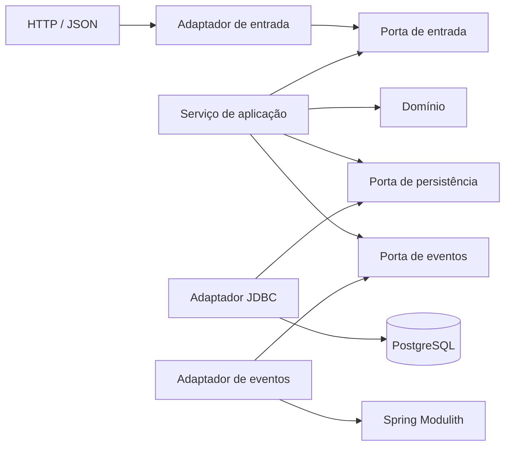
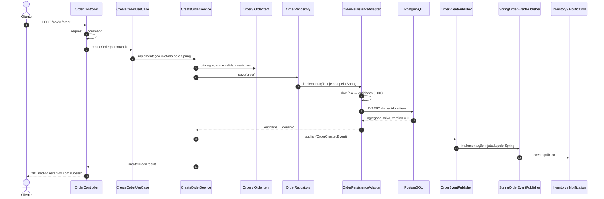

# Tutorial de arquitetura hexagonal com Spring Boot e Spring Modulith

Este tutorial explica arquitetura hexagonal usando o módulo `order` deste projeto como exemplo concreto. A proposta não é apresentar somente definições: vamos acompanhar o caminho real de uma requisição desde o HTTP, passando pelo domínio e pelo PostgreSQL, até a publicação do evento consumido por outros módulos.

## 1. O problema que a arquitetura hexagonal resolve

Uma aplicação Spring pode começar de forma simples:

```text
Controller → Service → Repository → Banco
```

Esse fluxo funciona, mas pode criar alguns problemas conforme o projeto cresce:

- o controller passa a conhecer detalhes da persistência;
- o service passa a depender diretamente do Spring Data;
- o modelo de negócio recebe anotações de banco;
- trocar uma tecnologia exige alterar regras de negócio;
- testes do caso de uso passam a exigir Spring e banco de dados;
- as responsabilidades ficam organizadas por tecnologia, não por intenção.

A arquitetura hexagonal organiza essas dependências em torno do negócio. O centro da aplicação declara o que precisa por meio de interfaces, chamadas de **portas**. As tecnologias ficam nas bordas, em implementações chamadas de **adaptadores**.



As setas desse diagrama representam dependências de código. Observe o ponto mais importante: o serviço conhece interfaces, mas não conhece as classes que usam JDBC ou `ApplicationEventPublisher`.

## 2. Onde entra `OrdermodApplication`

O ponto de inicialização do projeto é [OrdermodApplication.java](../src/main/java/com/market/OrdermodApplication.java):

```java
package com.market;

@SpringBootApplication
public class OrdermodApplication {

    public static void main(String[] args) {
        SpringApplication.run(OrdermodApplication.class, args);
    }
}
```

Como essa classe está no pacote `com.market`, o Spring procura componentes nos seus subpacotes. Assim, ele encontra controllers, services, repositories, adaptadores e listeners existentes em:

```text
com.market.order
com.market.inventory
com.market.notification
com.market.payment
```

`OrdermodApplication` não pertence a uma porta ou adaptador do módulo `order`. Ela é o ponto de composição da aplicação: inicializa o container Spring e permite que as implementações sejam conectadas às interfaces.

Por exemplo:

- `CreateOrderService` implementa `CreateOrderUseCase`;
- `OrderPersistenceAdapter` implementa `OrderRepository`;
- `SpringOrderEventPublisher` implementa `OrderEventPublisher`;
- o Spring encontra essas classes e injeta cada implementação onde sua interface é exigida.

Esse processo é chamado de **injeção de dependência**. A decisão arquitetural mais importante é que as classes internas dependem das abstrações corretas antes mesmo de o Spring fazer essa ligação.

## 3. Spring Modulith e arquitetura hexagonal não são a mesma coisa

O projeto usa as duas ideias em níveis diferentes:

```text
Aplicação Ordermod
├── order           ← módulo do Spring Modulith
│   └── arquitetura hexagonal interna
├── inventory       ← módulo do Spring Modulith
├── notification    ← módulo do Spring Modulith
└── payment         ← módulo do Spring Modulith
```

O Spring Modulith protege a comunicação **entre módulos**. A arquitetura hexagonal organiza as responsabilidades **dentro de um módulo**.

No módulo `order`:

- [OrderCreatedEvent.java](../src/main/java/com/market/order/OrderCreatedEvent.java) está na raiz e constitui uma API pública;
- tudo abaixo de `com.market.order.internal` é implementação interna;
- `inventory` e `notification` podem importar `OrderCreatedEvent`;
- esses módulos não devem importar controllers, domínio, portas ou entidades JDBC internas de `order`.

O nome `internal` não é um modificador de acesso do Java. A fronteira é fiscalizada pelo Spring Modulith e pelo teste que executa `ApplicationModules.verify()`.

## 4. Estrutura hexagonal do módulo `order`

A estrutura implementada é:

```text
com/market/order
├── OrderCreatedEvent.java                  # API pública do módulo
├── package-info.java
└── internal
    ├── domain
    │   ├── model
    │   │   ├── Order.java
    │   │   └── OrderItem.java
    │   ├── exception
    │   │   └── OrderDomainException.java
    │   └── package-info.java
    │
    ├── application
    │   ├── port
    │   │   ├── in
    │   │   │   ├── CreateOrderUseCase.java
    │   │   │   ├── CreateOrderCommand.java
    │   │   │   └── CreateOrderResult.java
    │   │   └── out
    │   │       ├── OrderRepository.java
    │   │       └── OrderEventPublisher.java
    │   ├── service
    │   │   └── CreateOrderService.java
    │   └── package-info.java
    │
    └── adapter
        ├── in
        │   └── web
        │       ├── CreateOrderRequest.java
        │       ├── OrderController.java
        │       └── OrderHttpApi.java
        │
        └── out
            ├── persistence
            │   └── jdbc
            │       ├── OrderPersistenceAdapter.java
            │       ├── SpringDataOrderRepository.java
            │       ├── OrderJdbcEntity.java
            │       ├── OrderItemJdbcEntity.java
            │       └── OrderPersistenceMapper.java
            │
            └── event
                └── SpringOrderEventPublisher.java
```

Uma forma simples de memorizar é:

| Área | Pergunta respondida |
| --- | --- |
| `domain` | Quais são os conceitos e regras do negócio? |
| `application` | Quais casos de uso a aplicação oferece e do que eles precisam? |
| `adapter.in` | Como uma tecnologia externa inicia um caso de uso? |
| `adapter.out` | Como a aplicação acessa uma tecnologia externa? |

## 5. Domínio: o centro das regras de negócio

O domínio contém os conceitos que existiriam mesmo se o projeto deixasse de usar Spring, HTTP ou PostgreSQL.

### 5.1 `Order` e `OrderItem`

[Order.java](../src/main/java/com/market/order/internal/domain/model/Order.java) e [OrderItem.java](../src/main/java/com/market/order/internal/domain/model/OrderItem.java) são records Java sem anotações do Spring Data.

Algumas invariantes protegidas por essas classes são:

- identificadores obrigatórios;
- forma de pagamento não vazia;
- pedido com pelo menos um item;
- nenhum item nulo;
- quantidade maior que zero;
- versão não negativa;
- cópia defensiva da lista de itens.

Trecho simplificado de `OrderItem`:

```java
public record OrderItem(UUID id, UUID productId, int quantity) {

    public OrderItem {
        if (productId == null) {
            throw new OrderDomainException("productId é obrigatório");
        }

        if (quantity <= 0) {
            throw new OrderDomainException("quantity deve ser maior que zero");
        }
    }
}
```

A regra está no domínio porque uma quantidade inválida continua sendo inválida independentemente de a entrada vir de HTTP, mensageria, linha de comando ou teste.

### 5.2 `OrderDomainException`

[OrderDomainException.java](../src/main/java/com/market/order/internal/domain/exception/OrderDomainException.java) representa uma violação das regras de pedido.

Isso evita espalhar exceções genéricas sem significado. No futuro, um adaptador HTTP poderá converter essa exceção para uma resposta padronizada sem fazer o domínio depender de `ResponseEntity` ou de códigos HTTP.

### 5.3 Por que o domínio não usa as entidades JDBC?

O domínio e o banco possuem objetivos diferentes:

- `Order` representa o negócio;
- `OrderJdbcEntity` representa o formato exigido pelo Spring Data JDBC;
- uma alteração na tabela não deve obrigar a colocar anotações técnicas no domínio;
- uma regra de negócio não deve ser limitada pela estrutura de uma tabela.

O campo `version` no domínio é uma escolha pragmática para preservar o controle otimista entre leituras e gravações, mas ele não possui nenhuma anotação do Spring.

## 6. Portas de entrada: o que a aplicação permite fazer

Uma porta de entrada descreve uma capacidade oferecida pela aplicação.

[CreateOrderUseCase.java](../src/main/java/com/market/order/internal/application/port/in/CreateOrderUseCase.java) contém somente o contrato:

```java
public interface CreateOrderUseCase {

    CreateOrderResult createOrder(CreateOrderCommand command);
}
```

Essa interface não sabe se será chamada por REST, GraphQL, mensageria ou um teste. Ela apenas define que a aplicação sabe criar um pedido.

Os outros tipos dessa fronteira são:

- [CreateOrderCommand.java](../src/main/java/com/market/order/internal/application/port/in/CreateOrderCommand.java): dados necessários para executar o caso de uso;
- [CreateOrderResult.java](../src/main/java/com/market/order/internal/application/port/in/CreateOrderResult.java): resultado devolvido pelo caso de uso.

### DTO HTTP não é comando de aplicação

`CreateOrderRequest` e `CreateOrderCommand` possuem campos parecidos, mas têm responsabilidades diferentes:

| Tipo | Responsabilidade |
| --- | --- |
| `CreateOrderRequest` | Representar e validar o JSON recebido pelo endpoint |
| `CreateOrderCommand` | Representar a intenção de criar um pedido na aplicação |

Se o formato do JSON mudar, o comando não precisa mudar automaticamente. Se outro adaptador iniciar o mesmo caso de uso, ele pode criar o mesmo comando sem depender de uma classe web.

## 7. Serviço de aplicação: orquestração do caso de uso

[CreateOrderService.java](../src/main/java/com/market/order/internal/application/service/CreateOrderService.java) implementa a porta de entrada:

```java
@Service
public class CreateOrderService implements CreateOrderUseCase {

    private final OrderRepository orderRepository;
    private final OrderEventPublisher eventPublisher;

    @Override
    @Transactional
    public CreateOrderResult createOrder(CreateOrderCommand command) {
        // cria o domínio
        // persiste usando uma porta
        // publica usando outra porta
        // devolve o resultado
    }
}
```

O serviço de aplicação coordena o fluxo, mas não implementa JDBC nem HTTP. Suas responsabilidades atuais são:

1. transformar o comando em `Order` e `OrderItem`;
2. pedir que o agregado seja persistido;
3. montar e publicar `OrderCreatedEvent` usando o agregado salvo;
4. retornar `CreateOrderResult`.

O método é transacional. Portanto, a persistência do pedido e o registro durável da publicação confirmam ou sofrem rollback juntos.

Esta é uma arquitetura hexagonal **pragmática**, não dogmática. O serviço ainda usa `@Service`, `@Transactional`, `UUID.randomUUID()` e `Instant.now()`. Se o projeto exigir um núcleo totalmente independente do framework ou controle determinístico do tempo e dos IDs, essas capacidades poderão ser extraídas para portas como `Clock` e `IdGenerator`.

## 8. Portas de saída: o que a aplicação precisa do exterior

Uma porta de saída é uma interface definida pelo lado da aplicação, não pela tecnologia.

### 8.1 Persistência

[OrderRepository.java](../src/main/java/com/market/order/internal/application/port/out/OrderRepository.java):

```java
public interface OrderRepository {

    Order save(Order order);
}
```

O caso de uso sabe que precisa salvar um pedido. Ele não sabe se isso será feito com PostgreSQL, MongoDB, arquivo ou memória.

### 8.2 Publicação de eventos

[OrderEventPublisher.java](../src/main/java/com/market/order/internal/application/port/out/OrderEventPublisher.java):

```java
public interface OrderEventPublisher {

    void publish(OrderCreatedEvent event);
}
```

O caso de uso sabe que precisa anunciar o fato `OrderCreatedEvent`. Ele não conhece diretamente `ApplicationEventPublisher`.

Esse desenho aplica a inversão de dependência:

```text
CreateOrderService → OrderRepository ← OrderPersistenceAdapter
CreateOrderService → OrderEventPublisher ← SpringOrderEventPublisher
```

Tanto o serviço quanto os adaptadores dependem das portas. As portas pertencem à aplicação.

## 9. Adaptador de entrada HTTP

O adaptador de entrada traduz o protocolo externo para a linguagem da aplicação.

### 9.1 Contrato HTTP

[OrderHttpApi.java](../src/main/java/com/market/order/internal/adapter/in/web/OrderHttpApi.java) concentra as anotações REST e OpenAPI:

```text
POST /api/v1/order
Content-Type: application/json
Resposta: 201 Created, text/plain
```

### 9.2 Request e validação

[CreateOrderRequest.java](../src/main/java/com/market/order/internal/adapter/in/web/CreateOrderRequest.java) recebe o JSON e aplica Jakarta Bean Validation:

- `customerId` obrigatório;
- `paymentMethod` não vazio;
- pelo menos um item;
- `productId` obrigatório;
- `quantity` positiva.

Essas validações protegem a fronteira HTTP. As invariantes do domínio continuam necessárias porque o domínio também pode ser criado por outras entradas.

### 9.3 Controller

[OrderController.java](../src/main/java/com/market/order/internal/adapter/in/web/OrderController.java) realiza três operações:

1. converte `CreateOrderRequest` em `CreateOrderCommand`;
2. chama `CreateOrderUseCase`;
3. converte o resultado da aplicação em resposta HTTP.

O controller depende da interface:

```java
private final CreateOrderUseCase createOrderUseCase;
```

Ele não depende de `CreateOrderService`, `OrderPersistenceAdapter` ou `SpringDataOrderRepository`. Isso mantém a entrada HTTP desacoplada das implementações.

## 10. Adaptador de saída JDBC

O adaptador JDBC converte a necessidade abstrata de persistência em operações concretas do Spring Data JDBC.

### 10.1 Entidades relacionais

[OrderJdbcEntity.java](../src/main/java/com/market/order/internal/adapter/out/persistence/jdbc/OrderJdbcEntity.java) e [OrderItemJdbcEntity.java](../src/main/java/com/market/order/internal/adapter/out/persistence/jdbc/OrderItemJdbcEntity.java) possuem as anotações técnicas:

```java
@Table(name = "orders", schema = "orders")
public record OrderJdbcEntity(
        @Id UUID id,
        @Column("customer_id") UUID customerId,
        @Version Integer version,
        @MappedCollection(idColumn = "order_id", keyColumn = "item_index")
        List<OrderItemJdbcEntity> items
) {
}
```

Pontos importantes:

- `OrderJdbcEntity` é a raiz do agregado JDBC;
- `@MappedCollection` associa os itens pelo `order_id`;
- `item_index` preserva a ordem da lista;
- `@Version` habilita controle otimista;
- uma entidade nova possui versão `null`; após o primeiro INSERT, a versão passa para `0`.

As tabelas são criadas pela migration [V1__create_order_tables.sql](../src/main/resources/db/migration/V1__create_order_tables.sql).

### 10.2 Repositório técnico

[SpringDataOrderRepository.java](../src/main/java/com/market/order/internal/adapter/out/persistence/jdbc/SpringDataOrderRepository.java) estende `CrudRepository`.

Essa interface é um detalhe do adaptador. O serviço de aplicação não deve importá-la.

### 10.3 Mapper

[OrderPersistenceMapper.java](../src/main/java/com/market/order/internal/adapter/out/persistence/jdbc/OrderPersistenceMapper.java) converte nos dois sentidos:

```text
Order              → OrderJdbcEntity
OrderItem          → OrderItemJdbcEntity
OrderJdbcEntity    → Order
OrderItemJdbcEntity → OrderItem
```

O mapper é o custo explícito de manter o domínio independente da persistência. Esse custo evita que o modelo de negócio fique acoplado às anotações e decisões relacionais.

### 10.4 Implementação da porta

[OrderPersistenceAdapter.java](../src/main/java/com/market/order/internal/adapter/out/persistence/jdbc/OrderPersistenceAdapter.java) implementa a porta `OrderRepository`:

```java
@Repository
public class OrderPersistenceAdapter implements OrderRepository {

    @Override
    public Order save(Order order) {
        var entity = mapper.toEntity(order);
        var savedEntity = repository.save(entity);
        return mapper.toDomain(savedEntity);
    }
}
```

Para a aplicação, existe apenas `OrderRepository.save`. Para o adaptador, existem mapper, entidade JDBC e `CrudRepository`.

## 11. Adaptador de saída de eventos

[SpringOrderEventPublisher.java](../src/main/java/com/market/order/internal/adapter/out/event/SpringOrderEventPublisher.java) implementa a porta de eventos e delega para o Spring:

```java
@Component
public class SpringOrderEventPublisher implements OrderEventPublisher {

    private final ApplicationEventPublisher eventPublisher;

    @Override
    public void publish(OrderCreatedEvent event) {
        eventPublisher.publishEvent(event);
    }
}
```

Se a estratégia de publicação mudar no futuro, uma nova implementação da porta poderá ser criada sem colocar APIs técnicas dentro de `CreateOrderService`.

## 12. Evento público e comunicação entre módulos

[OrderCreatedEvent.java](../src/main/java/com/market/order/OrderCreatedEvent.java) fica fora de `internal` porque representa a API pública do módulo `order`.

Depois da publicação:

- [InventoryOrderCreatedListener.java](../src/main/java/com/market/inventory/internal/application/InventoryOrderCreatedListener.java) solicita a reserva dos itens;
- [NotificationOrderCreatedListener.java](../src/main/java/com/market/notification/internal/application/NotificationOrderCreatedListener.java) reage para realizar a notificação.

Os consumidores conhecem o evento público, mas não conhecem o domínio interno de `order`:

```text
inventory    → com.market.order.OrderCreatedEvent
notification → com.market.order.OrderCreatedEvent
```

O uso de `@ApplicationModuleListener` também permite ao Spring Modulith registrar publicações na tabela `event_publication`. Isso oferece rastreabilidade e possibilidade de reprocessamento para consumidores transacionais.

## 13. Fluxo completo de criação de pedido

Agora podemos acompanhar toda a execução:



Em termos de modelos, as conversões são:

```text
JSON
  ↓
CreateOrderRequest             adapter.in.web
  ↓
CreateOrderCommand             application.port.in
  ↓
Order + OrderItem              domain.model
  ↓
OrderJdbcEntity + itens        adapter.out.persistence.jdbc
  ↓
PostgreSQL

Order + OrderItem
  ↓
OrderCreatedEvent              API pública de order
  ↓
inventory / notification
```

## 14. Como os testes refletem a arquitetura

A organização dos testes acompanha as responsabilidades do código:

| Teste | O que protege |
| --- | --- |
| `OrderTest` e `OrderItemTest` | Invariantes e exceções do domínio |
| `CreateOrderServiceTest` | Caso de uso por meio de portas falsas, sem Spring e banco |
| `OrderControllerTest` | Conversão de request para command |
| `OrderControllerHttpTest` | Contrato HTTP e validação com MockMvc |
| `OrderPersistenceMapperTest` | Conversão domínio ↔ JDBC |
| `SpringOrderEventPublisherTest` | Delegação para o publicador Spring |
| `OrderPersistenceAdapterTest` | Persistência real com PostgreSQL via Testcontainers |
| `CreateOrderIntegrationTest` | Pedido, itens e publicações duráveis completas |
| `CreateOrderTransactionIntegrationTest` | Rollback conjunto de pedido, itens e evento |
| `ModularityTests` | Fronteiras entre módulos do Spring Modulith |
| `HexagonalArchitectureTests` | Direção das dependências dentro de `order` |

O teste de unidade do serviço consegue usar implementações simples das portas:

```java
OrderRepository repository = order -> savedOrder;
OrderEventPublisher publisher = publishedEvents::add;

var service = new CreateOrderService(repository, publisher);
```

Esse é um benefício direto da arquitetura: a regra de orquestração pode ser testada sem iniciar PostgreSQL ou o contexto Spring.

Para executar toda a suíte neste projeto:

```bash
JAVA_HOME=/home/wolf/.sdkman/candidates/java/25.0.3-tem ./mvnw clean test
```

Os testes de integração exigem Docker, pois iniciam PostgreSQL 18.6 por Testcontainers.

## 15. Onde colocar uma nova funcionalidade

Suponha que seja necessário consultar um pedido pelo identificador.

Uma evolução coerente seria:

```text
application/port/in
├── GetOrderUseCase.java
├── GetOrderQuery.java
└── GetOrderResult.java

application/service
└── GetOrderService.java

application/port/out
└── OrderRepository.java              # recebe findById

adapter/in/web
└── OrderController.java              # recebe GET e chama a porta

adapter/out/persistence/jdbc
├── OrderPersistenceAdapter.java      # implementa findById
└── SpringDataOrderRepository.java    # fornece acesso JDBC
```

O processo mental é:

1. definir a intenção como porta de entrada;
2. implementar o caso de uso na camada de aplicação;
3. usar o domínio para regras de negócio;
4. declarar necessidades externas como portas de saída;
5. implementar cada tecnologia em um adaptador;
6. expor o caso de uso pelo adaptador de entrada apropriado.

## 16. Erros comuns a evitar

### Controller chamando Spring Data diretamente

Evite:

```text
OrderController → SpringDataOrderRepository
```

O correto neste projeto é:

```text
OrderController → CreateOrderUseCase
```

### Serviço importando entidade JDBC

Evite usar `OrderJdbcEntity` dentro de `CreateOrderService`. O serviço trabalha com o domínio `Order`; a conversão pertence ao adaptador.

### Domínio retornando `ResponseEntity`

Códigos HTTP pertencem ao adaptador web. O domínio deve expressar sucesso, resultado ou exceção em termos do negócio.

### Reutilizar request como domínio

O request representa um contrato externo e pode mudar por motivos de API. O domínio deve mudar por motivos de negócio.

### Colocar contrato compartilhado em `internal`

Se outro módulo precisa importar um evento, esse contrato deve estar na API pública do módulo produtor, como ocorre com `OrderCreatedEvent`.

### Criar interfaces sem uma fronteira real

Arquitetura hexagonal não significa criar interface para toda classe. As portas representam entradas oferecidas pela aplicação ou dependências externas exigidas por ela.

## 17. Regra prática para classificar uma classe

Ao criar uma classe, faça estas perguntas:

1. **É uma regra ou conceito do negócio?** Coloque em `domain`.
2. **Representa um caso de uso oferecido?** Coloque em `application.port.in`.
3. **Orquestra um caso de uso?** Coloque em `application.service`.
4. **Representa algo externo de que a aplicação precisa?** Declare em `application.port.out`.
5. **Recebe HTTP, mensagem ou comando externo?** É um `adapter.in`.
6. **Usa banco, framework de eventos ou serviço externo?** É um `adapter.out`.
7. **Outro módulo precisa importar o tipo?** Avalie colocá-lo na API pública do módulo, fora de `internal`.

## 18. Resumo

No projeto `OrdermodApplication`, a arquitetura funciona da seguinte forma:

- `OrdermodApplication` inicia o Spring e compõe as implementações;
- Spring Modulith define e verifica as fronteiras entre os módulos de negócio;
- o adaptador HTTP converte JSON em um comando de aplicação;
- a porta de entrada descreve o caso de uso;
- o serviço de aplicação coordena domínio, persistência e evento;
- o domínio protege as invariantes sem depender de Spring Data;
- as portas de saída descrevem necessidades externas;
- os adaptadores JDBC e de eventos implementam essas necessidades;
- `OrderCreatedEvent` funciona como contrato público entre módulos;
- testes unitários, arquiteturais e de integração protegem essas decisões.

A essência não está nos nomes das pastas. Ela está na direção das dependências: regras e casos de uso não devem depender dos detalhes tecnológicos que existem nas bordas da aplicação.

