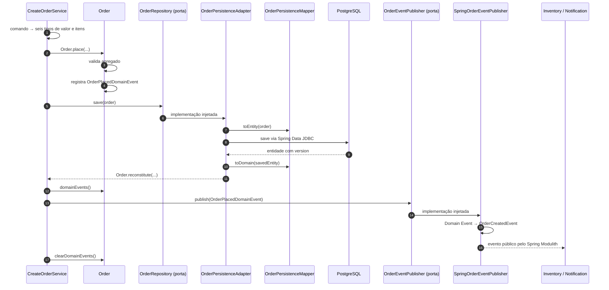

# Tutorial de DDD tático no módulo `order`

Este tutorial explica os padrões táticos de Domain-Driven Design (DDD) implementados no módulo `order`. O domínio é pequeno de propósito: o objetivo aqui é tornar cada padrão visível e estudá-lo em código real, não justificar complexidade desnecessária para um cadastro simples.

Para entender as portas e os adaptadores que cercam esse modelo, consulte também o [tutorial de arquitetura hexagonal](tutorial-arquitetura-hexagonal.md). A visão consolidada do sistema está em [Arquitetura do Ordermod](architecture.md).

## 1. O que significa DDD tático

DDD possui duas perspectivas complementares:

- **DDD estratégico** ajuda a descobrir subdomínios, contextos delimitados e relações entre equipes e modelos;
- **DDD tático** oferece blocos de construção para expressar um modelo dentro de uma fronteira já escolhida.

Neste estudo, o foco está nos blocos táticos:

| Bloco | Implementação no projeto |
| --- | --- |
| Aggregate Root | `Order` |
| Entity interna ao agregado | `OrderItem` |
| Value Objects | `OrderId`, `CustomerId`, `OrderItemId`, `ProductId`, `Quantity` e `PaymentMethod` |
| Invariantes | Construtores privados, factories e `OrderDomainException` |
| Domain Event | `OrderPlacedDomainEvent` |
| Repository | `OrderRepository` |
| Tradução domínio ↔ persistência | `OrderPersistenceMapper` |
| Application Service | `CreateOrderService` |
| Evento público entre módulos | `OrderCreatedEvent` |

Esses padrões convivem com a arquitetura já existente:

```text
Spring Modulith       protege a fronteira entre order e os demais módulos
Arquitetura hexagonal direciona dependências dentro de order
DDD tático            modela identidade, valores, invariantes e fatos do domínio
```

Uma técnica não substitui a outra. Elas respondem a perguntas diferentes.

## 2. Estrutura do núcleo de domínio

Os tipos táticos ficam abaixo de `com.market.order.internal.domain`:

```text
internal/domain
├── event
│   ├── OrderDomainEvent.java
│   └── OrderPlacedDomainEvent.java
├── exception
│   └── OrderDomainException.java
├── model
│   ├── CustomerId.java
│   ├── Order.java
│   ├── OrderId.java
│   ├── OrderItem.java
│   ├── OrderItemId.java
│   ├── PaymentMethod.java
│   ├── ProductId.java
│   └── Quantity.java
└── package-info.java
```

Nada nessa árvore depende de Spring MVC, Spring Data JDBC ou `ApplicationEventPublisher`. O modelo pode ser instanciado e testado apenas com Java.

## 3. `Order` como Aggregate Root

Um **agregado** é um conjunto de objetos tratado como uma unidade de consistência. A **Aggregate Root** é a única porta de entrada conceitual para alterações nesse conjunto.

Neste projeto:

```text
Order                         Aggregate Root
└── List<OrderItem>           entidades pertencentes ao agregado
```

[Order.java](../src/main/java/com/market/order/internal/domain/model/Order.java) é a raiz porque:

- possui a identidade global do agregado, `OrderId`;
- mantém a coleção de itens;
- impede a criação de um pedido sem itens;
- rejeita itens nulos;
- protege a lista com `List.copyOf(...)`;
- registra os eventos produzidos pelo agregado;
- é o objeto salvo por `OrderRepository`.

Não existe `OrderItemRepository`. O item é persistido como parte do pedido porque a fronteira de consistência escolhida é o agregado inteiro.

### Identidade da raiz

`Order` é uma Entity: sua continuidade é definida pelo identificador, não pela igualdade de todos os atributos. Por isso, `equals` e `hashCode` usam `OrderId`.

Dois objetos carregados em momentos diferentes representam o mesmo pedido quando possuem o mesmo `OrderId`, mesmo que sua versão ou seus demais dados sejam diferentes.

### Invariantes protegidas pela raiz

O construtor de `Order` é privado. Toda instância passa pelo mesmo ponto de validação, seja nova ou recuperada do banco. Atualmente a raiz garante:

- `OrderId`, `CustomerId`, `PaymentMethod` e `createdAt` obrigatórios;
- pelo menos um `OrderItem`;
- ausência de itens nulos;
- versão nula para um agregado novo ou não negativa para um agregado persistido;
- coleção externa incapaz de alterar silenciosamente o estado interno.

Uma validação HTTP melhora a mensagem para o cliente, mas não substitui essas invariantes. O mesmo domínio pode ser chamado futuramente por mensageria, testes ou outro adaptador.

## 4. `OrderItem` como Entity

[OrderItem.java](../src/main/java/com/market/order/internal/domain/model/OrderItem.java) também é uma Entity porque possui identidade própria, `OrderItemId`, e sua igualdade é baseada nesse identificador.

```java
var item = OrderItem.create(
        new OrderItemId(itemId),
        new ProductId(productId),
        new Quantity(2),
        new Money(new BigDecimal("10.50"), "BRL")
);
```

O item pertence à fronteira do agregado `Order`. Ter identidade não significa que ele deva ganhar ciclo de vida ou repositório independente.

As factories `create(...)` e `reconstitute(...)` deixam explícita a intenção da chamada. Hoje ambas aplicam as mesmas invariantes, mas seus nomes permitem que criação e hidratação evoluam separadamente se o modelo passar a exigir isso.

## 5. Os Value Objects

Um **Value Object** é definido pelo seu valor, não por uma identidade própria. Ele costuma ser imutável, validar-se na construção e substituir tipos primitivos que perderam significado no modelo.

O projeto implementa sete Value Objects:

| Value Object | Valor encapsulado | Regra atual |
| --- | --- | --- |
| `OrderId` | `UUID` | não pode ser nulo |
| `CustomerId` | `UUID` | não pode ser nulo |
| `OrderItemId` | `UUID` | não pode ser nulo |
| `ProductId` | `UUID` | não pode ser nulo |
| `Quantity` | `int` | deve ser maior que zero |
| `PaymentMethod` | `String` | obrigatório, remove espaços nas pontas e não aceita vazio |
| `Money` | `BigDecimal` e código de moeda | valor não negativo, precisão decimal, moeda válida e aritmética entre moedas iguais |

Eles são records Java. Isso fornece imutabilidade dos componentes e igualdade por valor, duas características naturais de Value Objects.

### 5.1 Identificadores tipados

Sem tipos próprios, métodos diferentes poderiam aceitar vários `UUID` na mesma posição:

```java
// Todos parecem iguais para o compilador.
UUID orderId;
UUID customerId;
UUID productId;
```

Com identificadores tipados, a assinatura comunica a intenção e o compilador evita trocas acidentais:

```java
OrderId orderId;
CustomerId customerId;
ProductId productId;
```

`OrderId` e `OrderItemId` são Value Objects mesmo sendo usados como identidade de Entities. O UUID encapsulado é um valor; `Order` e `OrderItem` é que possuem continuidade por identidade.

### 5.2 `Quantity`

[Quantity.java](../src/main/java/com/market/order/internal/domain/model/Quantity.java) impede que uma quantidade inválida circule pelo domínio:

```java
public record Quantity(int value) {

    public Quantity {
        if (value <= 0) {
            throw new OrderDomainException("quantity deve ser maior que zero");
        }
    }
}
```

Depois que um método recebe `Quantity`, ele não precisa perguntar novamente se o número é positivo.

### 5.3 `PaymentMethod`

[PaymentMethod.java](../src/main/java/com/market/order/internal/domain/model/PaymentMethod.java) normaliza o texto com `strip()` e rejeita valores vazios. Assim, `" PIX "` é armazenado no modelo como `"PIX"`.

Ele ainda não restringe os valores a uma lista como `PIX` ou `CREDIT_CARD`. Essa é uma limitação consciente: sem uma regra de negócio definida, transformar o tipo em enum inventaria conhecimento que o projeto ainda não possui.

### 5.4 `Money`

`Money` mantém valor decimal e moeda juntos. O Value Object normaliza a escala para duas casas sem arredondamento silencioso, limita a precisão compatível com `NUMERIC(19,2)` e impede somas entre moedas diferentes. `OrderItem` multiplica o preço unitário pela quantidade; `Order` soma os subtotais.

## 6. Criação não é reconstituição

Uma das decisões mais importantes do modelo é separar dois motivos para obter um `Order`.

### 6.1 `Order.place(...)`: aconteceu algo novo

O método [Order.place(...)](../src/main/java/com/market/order/internal/domain/model/Order.java) representa a colocação de um novo pedido:

```java
var order = Order.place(
        new OrderId(UUID.randomUUID()),
        new CustomerId(command.customerId()),
        new PaymentMethod(command.paymentMethod()),
        Instant.now(),
        items
);
```

Além de validar o estado, ele:

1. calcula o total a partir dos subtotais;
2. inicia o pedido em `AGUARDANDO_ESTOQUE` e com `version = null`;
3. registra um `OrderPlacedDomainEvent` com a fotografia comercial na coleção interna de eventos.

O nome `place` expressa uma ação do domínio melhor do que um construtor genérico. O retorno é um pedido novo e um fato novo ocorreu.

### 6.2 `Order.reconstitute(...)`: algo já existia

O método `reconstitute(...)` recebe também a versão persistida e recria o agregado a partir do banco:

```java
return Order.reconstitute(
        new OrderId(entity.id()),
        new CustomerId(entity.customerId()),
        new PaymentMethod(entity.paymentMethod()),
        OrderStatus.valueOf(entity.status()),
        new Money(entity.totalAmount(), entity.currency()),
        entity.createdAt(),
        entity.version(),
        items
);
```

Reconstituir não registra `OrderPlacedDomainEvent`. O pedido já havia sido colocado no passado; carregá-lo novamente não significa que o fato ocorreu outra vez.

Essa separação evita um erro clássico:

```text
consulta ao banco
    → objeto reconstruído
    → evento de criação falso
    → consumidores executados novamente
```

## 7. Domain Event interno

[OrderDomainEvent.java](../src/main/java/com/market/order/internal/domain/event/OrderDomainEvent.java) é uma interface selada. No modelo atual, ela permite somente [OrderPlacedDomainEvent.java](../src/main/java/com/market/order/internal/domain/event/OrderPlacedDomainEvent.java).

O evento interno representa algo que ocorreu na linguagem do domínio: **o pedido foi colocado**. Ele usa os próprios Value Objects:

```text
OrderPlacedDomainEvent
├── OrderId
├── Instant occurredAt
├── CustomerId
├── PaymentMethod
└── itens
    ├── ProductId
    └── Quantity
```

`Order.place(...)` registra o evento, mas o domínio não o publica pelo Spring. A raiz apenas conserva os fatos ainda não despachados:

```java
order.domainEvents();
order.clearDomainEvents();
```

Isso preserva a independência do domínio em relação ao mecanismo técnico de eventos.

## 8. Domain Event não é o contrato público

O projeto separa dois tipos que poderiam parecer iguais à primeira vista:

| Tipo | Escopo | Linguagem dos dados | Pode ser importado por outros módulos? |
| --- | --- | --- | --- |
| `OrderPlacedDomainEvent` | domínio interno de `order` | Value Objects | Não |
| `OrderCreatedEvent` | integração entre módulos | `UUID`, `String`, `int` e `Instant` | Sim |

[OrderCreatedEvent.java](../src/main/java/com/market/order/OrderCreatedEvent.java) fica fora de `internal`, na API pública do módulo. `inventory` e `notification` dependem desse contrato, mas não precisam conhecer `Order`, `Quantity` ou qualquer outro detalhe interno.

O serviço de aplicação despacha o fato por uma porta; o adaptador de saída traduz os eventos na fronteira com o Spring:

```text
Order.place(...)
    → OrderPlacedDomainEvent          linguagem interna
    → CreateOrderService             despacha pela porta
    → SpringOrderEventPublisher      tradução na borda
    → OrderCreatedEvent              contrato público
    → Inventory / Notification
```

Por isso, `OrderEventPublisher.publish(...)` recebe `OrderDomainEvent`, não `OrderCreatedEvent`. [SpringOrderEventPublisher.java](../src/main/java/com/market/order/internal/adapter/out/event/SpringOrderEventPublisher.java) reconhece `OrderPlacedDomainEvent`, desembrulha seus Value Objects, cria o contrato público e então chama `ApplicationEventPublisher`.

Essa separação permite que o modelo interno e o contrato compartilhado evoluam por motivos diferentes. Ela também deixa claro que a Aggregate Root apenas registra o fato; a aplicação decide despachá-lo e o adaptador assume o contrato e o mecanismo de integração.

Os nomes `Placed` e `Created` ainda refletem vocabulários diferentes. Em um projeto real, a linguagem ubíqua decidiria se essa distinção é intencional ou se o contrato público deveria adotar outro nome, com o devido versionamento.

## 9. Repository orientado ao agregado

[OrderRepository.java](../src/main/java/com/market/order/internal/application/port/out/OrderRepository.java) expõe a coleção conceitual de agregados:

```java
public interface OrderRepository {

    Order save(Order order);
}
```

Embora DDD frequentemente desenhe repositories junto ao domínio, neste projeto a interface fica em `application.port.out`. Essa é uma escolha coerente com a arquitetura hexagonal: persistir é uma necessidade do caso de uso, e a aplicação declara a porta sem conhecer a tecnologia.

Os pontos importantes para o DDD são:

- o contrato recebe e devolve `Order`, não entidades JDBC;
- a unidade salva é a Aggregate Root completa;
- não existe repository separado para `OrderItem`;
- o domínio não conhece `CrudRepository`.

O retorno permite que o adaptador devolva a versão atribuída pelo Spring Data JDBC após a gravação.

## 10. Mapper como proteção do modelo

O modelo de domínio e o modelo relacional são deliberadamente diferentes:

```text
Domínio                            Persistência
OrderId                            UUID
CustomerId                         UUID
PaymentMethod                      String
OrderItemId / ProductId            UUID / UUID
Quantity                           int
Order                              OrderJdbcEntity
OrderItem                          OrderItemJdbcEntity
```

[OrderPersistenceMapper.java](../src/main/java/com/market/order/internal/adapter/out/persistence/jdbc/OrderPersistenceMapper.java) atua como uma camada de tradução.

Na ida ao banco, ele desembrulha os Value Objects com `value()`. Na volta, recria os tipos e usa `Order.reconstitute(...)` e `OrderItem.reconstitute(...)`.

Esse detalhe é essencial: se o mapper chamasse `Order.place(...)`, cada leitura do banco registraria indevidamente um novo evento de domínio.

[OrderPersistenceAdapter.java](../src/main/java/com/market/order/internal/adapter/out/persistence/jdbc/OrderPersistenceAdapter.java) combina mapper e repository técnico:

```text
OrderRepository.save(order)
    → mapper.toEntity(order)
    → SpringDataOrderRepository.save(entity)
    → mapper.toDomain(savedEntity)
    → Order reconstituído
```

O custo é código de mapeamento explícito. O benefício é impedir que decisões de JDBC, como `@Table`, `@MappedCollection` e `@Version`, contaminem o modelo de negócio.

## 11. Serviço de aplicação e fluxo completo

[CreateOrderService.java](../src/main/java/com/market/order/internal/application/service/CreateOrderService.java) coordena o caso de uso. Ele não é a Aggregate Root e não deve concentrar as invariantes que pertencem a `Order` ou aos Value Objects.

Suas responsabilidades atuais são:

1. receber `CreateOrderCommand`;
2. gerar identificadores e capturar o instante atual;
3. transformar valores de entrada nos tipos do domínio;
4. invocar `Order.place(...)`;
5. persistir o agregado por `OrderRepository`;
6. entregar os Domain Events pendentes a `OrderEventPublisher`;
7. limpar os eventos depois do despacho bem-sucedido;
8. devolver `CreateOrderResult` com o identificador persistido.



O método do caso de uso é transacional. A separação entre evento interno e público não altera a garantia já existente: pedido, itens e registro durável da publicação pertencem à mesma transação de origem.

## 12. Como reconhecer cada objeto

Use estas perguntas ao evoluir o módulo:

1. **Possui continuidade ao longo do tempo?** Provavelmente é uma Entity.
2. **É definido apenas pelos seus atributos?** Provavelmente é um Value Object.
3. **Delimita uma transação e protege um conjunto de objetos?** É candidato a Aggregate Root.
4. **Descreve algo que já aconteceu no negócio?** É candidato a Domain Event.
5. **Oferece acesso a uma coleção de agregados?** É candidato a Repository.
6. **Só coordena domínio e recursos externos?** Pertence a um Application Service.

O nome do padrão deve explicar uma necessidade do modelo. Não vale criar um tipo apenas para completar uma lista de padrões.

## 13. O que não foi aplicado

Este estudo não tenta implementar todo o catálogo de DDD. Não foram adicionados:

- Event Sourcing: o estado atual continua persistido em tabelas relacionais;
- CQRS: leitura e escrita não possuem modelos separados;
- Saga ou Process Manager: não existe ainda um fluxo longo coordenando estoque e pagamento;
- Domain Service: as regras atuais cabem na Aggregate Root e nos Value Objects;
- Specification: não há regra de seleção complexa que justifique o padrão;
- factory class separada: métodos nomeados como `place`, `create` e `reconstitute` são suficientes;
- repository para `OrderItem`: isso quebraria a fronteira escolhida do agregado;
- transições posteriores do pedido: o estado inicial existe, mas confirmação, cancelamento e expiração ainda dependem dos módulos seguintes;
- implementação completa de DDD estratégico: um módulo Spring Modulith é uma boa fronteira técnica, mas não se torna automaticamente um Bounded Context descoberto com especialistas do negócio;
- portas para relógio e geração de IDs: `Instant.now()` e `UUID.randomUUID()` continuam no serviço de aplicação como escolha pragmática.

Essas ausências não tornam a implementação incompleta. Elas delimitam o que está sendo estudado e evitam padrões sem problema real para resolver.

## 14. Checklist de estudo e testes

Os testes do modelo devem demonstrar o comportamento, não apenas getters:

- `Order.place(...)` cria um agregado novo e registra um único `OrderPlacedDomainEvent`;
- `Order.reconstitute(...)` preserva a versão e não registra evento;
- `Order` e `OrderItem` com a mesma identidade são iguais;
- cada identificador tipado rejeita `null`;
- `Quantity` rejeita zero e valores negativos;
- `PaymentMethod` normaliza espaços e rejeita texto vazio;
- `Money` protege escala, precisão e moeda, e não usa ponto flutuante binário;
- `OrderItem` calcula o subtotal e `Order` calcula o total e o estado inicial;
- listas recebidas pelo agregado e pelo evento não podem alterar seu estado depois da criação;
- o mapper desembrulha e recompõe os Value Objects e a fotografia comercial;
- a reconstituição feita pelo mapper não cria Domain Events;
- o serviço persiste antes de despachar o evento interno e só o limpa depois do sucesso;
- o adaptador de eventos converte `OrderPlacedDomainEvent` no `OrderCreatedEvent` correto.

A implementação foi validada desde uma compilação limpa com Java 25 e PostgreSQL 18.6 via Testcontainers:

```text
./mvnw clean test

Tests run: 50, Failures: 0, Errors: 0, Skipped: 0
BUILD SUCCESS
```

## 15. Resumo

O modelo tático pode ser lido como uma pequena história:

```text
CreateOrderService recebe a intenção
    → cria Entities e Value Objects válidos
    → Order.place protege a fronteira do agregado
    → a raiz registra OrderPlacedDomainEvent
    → OrderRepository persiste o agregado inteiro
    → OrderPersistenceMapper protege o domínio do JDBC
    → a aplicação despacha o fato interno por uma porta
    → SpringOrderEventPublisher o traduz na borda
    → OrderCreatedEvent cruza a fronteira do módulo
```

O principal aprendizado não é a quantidade de classes. É a responsabilidade explícita de cada conceito: identidade nas Entities, validade nos Value Objects, consistência na Aggregate Root, memória dos fatos nos Domain Events, coleção de agregados no Repository e coordenação no Application Service.
